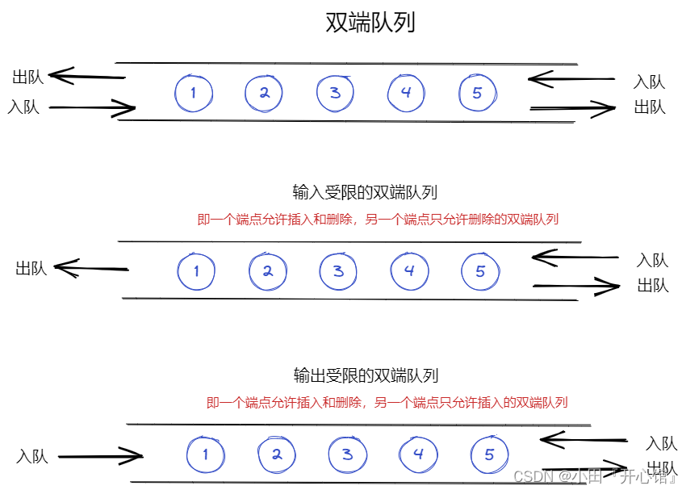

## 队列（Queues）

和栈相反，队列(queue)是一种先进先出(first in first out)的线性表（缩写为FIFO）。它只允许在表的一端进行插入，在另一端进行删除元素。这种数据结构概括起来就和我们平时排队是一样的道理，最早进入到的队列的元素最先离开。


在队列中，只允许插入的一端叫做队尾(rear)，允许删除的一端则称为队头(front)。假设队列为q = ( a 1 , a 2 , . . . a n ) ，那么，a1就是队头元素，an就是队尾元素。队列中的元素是按照a1,a2,a3....an的顺序进入的，退出队列也只能按照这个次序依次退出，也就是说，只有在a1,a2,a3...an-1都离开队列之后，an才能退出队列

队首队尾指针的两种指法：

-   ⭐队首指针（front）指向：队头元素的前一个存储位置
-   ⭐队尾指针（rear）指向：队尾元素
-   ⚡队首指针（front）指向：队头元素
-   ⚡队尾指针（rear）指向：队尾元素的下一个存储位置

>   假溢出：队中有空间，元素无法入队

队列是典型的 FIFO 数据结构。新元素始终被添加在队列的末尾。

Java中队列基本操作

| 操作    | 动作                     | 行为                                               |
| ------- | ------------------------ | -------------------------------------------------- |
| offer   | 添加一个元素并返回true   | 如果队列已满，则返回false                          |
| poll    | 移除并返问队列头部的元素 | 如果队列为空，则返回null                           |
| peek    | 返回队列头部的元素       | 如果队列为空，则返回null                           |
| add     | 增加一个元索             | 如果队列已满，则抛出一个IIIegaISlabEepeplian异常   |
| remove  | 移除并返回队列头部的元素 | 如果队列为空，则抛出一个NoSuchElementException异常 |
| element | 返回队列头部的元素       | 如果队列为空，则抛出一个NoSuchElementException异常 |

## 顺序队列

和顺序栈类似，在队列的顺序存储结构中，除了用一组地址连续的存储单元依次存放队列头到队列尾的元素之外，还需要附设两个指针`front`和`rear`分别指示队列头元素以及队列尾元素的位置。**基本操作基于循环队列，循环队列的引出是为了解决假溢出的问题。**

循环队列的性质

-   ⛅数组实现
-   空队列：front == rear
-   满队列：牺牲一个单元判满（不牺牲的话队空队满无法区分）
-   （rear+1）% maxSize == front
-   进队：rear新 = （rear旧+1）% maxSize
-   出队：front新 = （front旧+1）% maxSize
-   队中元素个数/长度：(rear - front + maxSize) % maxSize

### 初始化操作

初始化队列，构造一个空队列

```
#define MaxSize 10         //定义队列中元素的最大个数
typedef struct{
    ElemType data[MaxSize];     //用静态数组存放队列元素
    int front, rear;            //队头指针和队尾指针
}SqQueue;

//初始化队列
void InitQueue(SqQueue &Q){
    //初始化 队头、队尾指针指向0
    Q.rear = Q.front = 0;
}

void testQueue(){
    //声明一个队列（顺序存储）
    SqQueue Q;
    InitQueue(Q);
    ...
    //后续操作
}


//判断队列是否为空
bool QueueEmpty(SqQueue Q){
    if(Q.rear == Q.front){  //队空条件
        return true;
    }else{
        return false;
    }
}
```

### 入队操作

若队列未满，将x加入，使之称为新的队尾

```
#define MaxSize 10         //定义队列中元素的最大个数
typedef struct{
    ElemType data[MaxSize];     //用静态数组存放队列元素
    int front, rear;            //队头指针和队尾指针
}SqQueue;

//入队
bool EnQueue(SqQueue &Q, ElemType x){
    if((Q.rear+1)%MaxSize == Q.front){       //判断队列是否已满
        return false;       //对满则报错
    }
    Q.data[Q.rear] = x;     //将x插入队尾
    Q.rear = (Q.rear + 1) % MaxSize;    //队尾指针后移
    return true;
}
```

### 出队操作

若队列非空，删除队头元素并返回x

```
#define MaxSize 10         //定义队列中元素的最大个数
typedef struct{
    ElemType data[MaxSize];     //用静态数组存放队列元素
    int front, rear;            //队头指针和队尾指针
}SqQueue;

//出队(删除一个队头元素，并返回x)
bool DeQueue(SqQueue &Q, ElemType &x){
    if(Q.rear == Q.front){      //判断队空
        return false;           //队空则报错
    }
    x = Q.data[Q.front];
    Q.front = (Q.front+1)%MaxSize;
    return true;
}
```

### 获取队头元素操作

读队头元素，若队列非空，则将队头元素赋值给x

```
#define MaxSize 10         //定义队列中元素的最大个数
typedef struct{
    ElemType data[MaxSize];     //用静态数组存放队列元素
    int front, rear;            //队头指针和队尾指针
}SqQueue;

//获得队头元素的值，用x返回
bool GetHead(SqQueue Q, ElemType &x){
    if(Q.rear == Q.front){
        return false;       //队空报错
    }
    x = Q.data[Q.front];
    return true;
}
```

## 链式队列

和线性表类似，队列也可以有两种存储表示

用链表表示的队列简称为链队列，一个链队列显然需要两个分别指示队头和队尾的指针（分别称为头指针和尾指针）才能唯一确定。

链队列的操作即为单链表的插入和删除操作的特殊情况，只是需要修改尾指针或头指针

一般情况下，删除队列头元素时仅需修改头结点中的指针，但当队列中最后一个元素被删除后，队列表尾指针也丢失了，因此需对队尾指针重新赋值（指向头结点）

### 初始化队列，构造一个空队列

带头结点：

```
typedef struct LinkNode{        //链式队列结点
    ElemType data;
    struct LinkNode *next;
}LinkNode;

typedef struct{     //链式队列
    LinkNode *front, *rear  //队列的队头和队尾指针
}LinkQueue;

//初始化队列(带头结点)
void InitQueue(LinkQueue &Q){
    //初始化 front、rear都指向头结点
    Q.front = Q.rear = (LinkNode*)malloc(sizeof(LinkNode));
    Q.front -> next = NULL;
}

viod testLinkQueue(){
    LinkQueue Q;        //声明一个队列
    InitQueue(Q);       //初始化队列
}

//判断队列是否为空
bool IsEmpty(LinkQueue Q){
    if(Q.front == Q.rear){
        return true;
    }else{
        return false;
    }
}
```

不带头结点：

```
typedef struct LinkNode{        //链式队列结点
    ElemType data;
    struct LinkNode *next;
}LinkNode;

typedef struct{     //链式队列
    LinkNode *front, *rear  //队列的队头和队尾指针
}LinkQueue;

//初始化队列(不带头结点)
void InitQueue(LinkQueue &Q){
    //初始化 front、rear都指向头结点
    Q.front = NULL;
    Q.rear = NULL;
}

viod testLinkQueue(){
    LinkQueue Q;        //声明一个队列
    InitQueue(Q);       //初始化队列
}

//判断队列是否为空
bool IsEmpty(LinkQueue Q){
    if(Q.front == NULL){
        return true;
    }else{
        return false;
    }
}
```

### 入队操作

若队列未满，将x加入，使之称为新的队尾

带头结点：

```
typedef struct LinkNode{        //链式队列结点
    ElemType data;
    struct LinkNode *next;
}LinkNode;

typedef struct{     //链式队列
    LinkNode *front, *rear  //队列的队头和队尾指针
}LinkQueue;

//新元素入队(带头结点)
void EnQueue(LinkQueue &Q, ElemType x){
    LinkNode *s = (LinkNode *)malloc(sizeof(LinkNode));
    s->data = x;
    s->next = NULL;
    Q.rear->next = s;       //新结点插入到rear之后
    Q.rear = s;             //修改表尾指针
}
```

不带头结点：

```
typedef struct LinkNode{        //链式队列结点
    ElemType data;
    struct LinkNode *next;
}LinkNode;

typedef struct{     //链式队列
    LinkNode *front, *rear  //队列的队头和队尾指针
}LinkQueue;

//新元素入队(不带头结点)
void EnQueue(LinkQueue &Q, ElemType x){
    LinkNode *s = (LinkNode *)malloc(sizeof(LinkNode));
    s->data = x;
    s->next = NULL;
    if(Q.front == NULL){        //在空队列中插入第一个元素
        Q.front = s;            //修改队头队尾指针
        Q.rear = s;
    }else{
        Q.rear->next = s;       //新结点插入到rear结点之后
        Q.rear = s;             //修改rear指针
    }
}
```

### 出队操作

若队列非空，删除队头元素并返回x

带头结点：

```
typedef struct LinkNode{        //链式队列结点
    ElemType data;
    struct LinkNode *next;
}LinkNode;

typedef struct{     //链式队列
    LinkNode *front, *rear  //队列的队头和队尾指针
}LinkQueue;

//队头元素出队操作(带头结点)
bool DEQueue(LinkQueue &Q, ElemType &x){
    if(Q.front == Q.rear){
        return      //空队列
    }
    LinkNode *p = Q.front->next;
    x = p->data;        //用变量x返回队头元素
    Q.front->nexy = p->nexy;        //修改头结点的next指针
    if(Q.rear == p){                //此次是最后一个结点出队
        Q.rear = Q.front            //修改rear指针
    }
    free(p);                        //释放结点空间
    return true;
}
```

不带头结点：

```
typedef struct LinkNode{        //链式队列结点
    ElemType data;
    struct LinkNode *next;
}LinkNode;

typedef struct{     //链式队列
    LinkNode *front, *rear  //队列的队头和队尾指针
}LinkQueue;

//队头元素出队操作(不带头结点)
bool DEQueue(LinkQueue &Q, ElemType &x){
    if(Q.front == Q.rear){
        return      //空队列
    }
    LinkNode *p = Q.front;      //p指向此次出队的结点
    x=p->data;                  //用变量x返回队头结点元素
    Q.front = p->next;          //修改front指针
    if(Q.rear == p){            //此次是最后一个结点出队
        Q.front = NULL;         //front指向NULL
        Q.rear = NULL;          //rear 指向NULL
    }
    free(p);                    //释放结点空间
    return true;
}
```

## 循环队列

## 双端队列

除了栈和队列之外，还有一种限定性数据结构——双端队列(deque)

双端队列是限定插入和删除操作在表的两端进行的线性表。着两端分别称作端点1和端点2



在实际使用中，还可以有输出受限的双端队列（即一个端点允许插入和删除，另一个端点只允许插入的双端队列）和输入受限的双端队列（即一个端点允许插入和删除，另一个端点只允许删除的双端队列）。而如果限定双端队列从某个端点插入的元素只能从该端点删除，则该双端队列就蜕变为了两个栈底相邻接的栈了

## 优先队列

-   一种不必遵循队列先进先出(FIFO)特性的特殊队列
-   每次入队时，都会按照入队数据项的关键值进行排序(从大到小、从小到大)，这样保证了关键字最小的或者最大的项始终在队头，出队的时候优先级最高的就最先出队

Java对应实现

```
Queue<Integer> queue = new PriorityQueue<Integer>();
```
