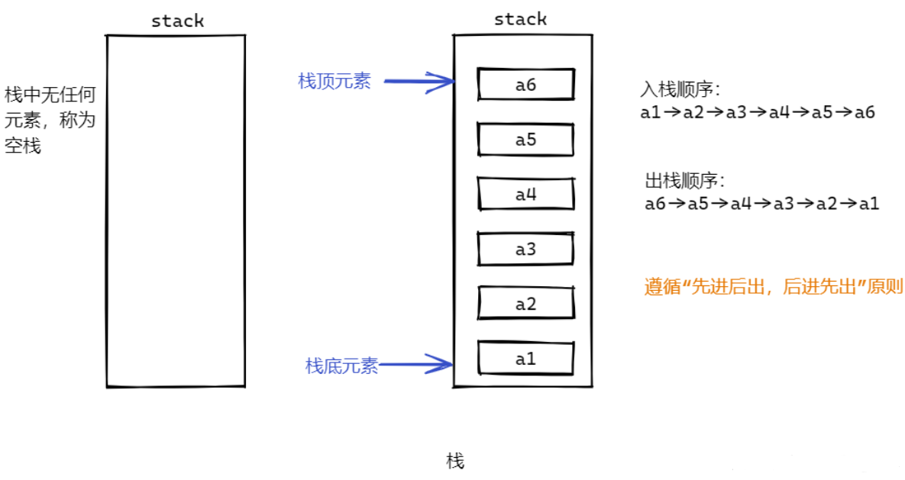
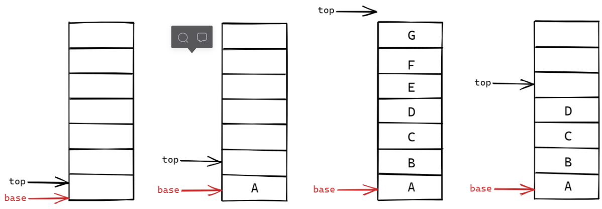

# 栈（satck）

从数据结构角度看，栈和队列也是线性表，其特殊性在于栈和队列的基本操作是线性表操作的子集，它们是操作受限的线性表，因此，可称为限定性的数据结构。

**栈**(**stack**)**是限定仅在表尾进行插入或删除操作的线性表**。因此，对于栈来说，表尾端有其特殊的含义，称为`栈顶(top)`，相应地，表头端称为`栈底(bottom)`。不包含元素的空表称为**空栈**。



假设S = ( a 1 , a 2 , . . . . a n )，则称a 1为栈底元素，a n为栈顶元素。栈中元素按a 1 , a 2 , . . . a n的次序进栈，那么出栈的第一个元素应为栈顶元素。


栈是限制仅在表的一端进行插入和删除运算的线性表，栈的修改是按照后进先出的原则进行的，因此，栈又称为后进先出(last in first out)的线性表（简称LIFO）结构。

Java栈的基本操作：

```
Stack<Integer> stack = new Stack<Integer>();
```

-   pop() 出栈操作，弹出栈顶元素。
-   push(E e) 入栈操作
-   peek() 查看栈顶元素
-   isEmpty() 栈为空
-   search(Object o) 返回对象在堆栈的位置，以1为基数

栈的非法操作：

- 上溢：当栈满了的情况下再次放入元素会造成此情况
- 下溢：当栈空了的情况下再次删除元素会造成此情况

## 顺序栈

顺序栈，即栈的顺序存储结构是利用一组地址连续的存储单元依次存放自栈底到栈顶的数据元素，同时附加指针top表示栈顶元素在顺序栈中的位置。通常当top=-1时，表示此栈为空栈。

### 顺序栈的定义

```
# define MaxSize 10         //定义栈中元素的最大个数
typedef struct{
    ElemType data[MaxSize];    //静态数组存放栈中元素 
    int top;                   //栈顶指针
}SqStack;

void testStack(){
    SqStack S;      //声明一个顺序栈(分配空间)
    .....
    //后续操作
}
```

由于栈在使用过程中所需要最大空间的大小很难估计，所以，一般来说，在初始化设空栈时不应限定栈的最大容量，常规做法是：先为栈分配一个基本容量，然后在应用过程中，当栈的空间不够使用时再逐步扩大容量

### 初始化操作

构造一个空栈，分配内存空间

```
# define MaxSize 10         //定义栈中元素的最大个数
typedef struct{
    ElemType data[MaxSize];    //静态数组存放栈中元素 
    int top;                   //栈顶指针
}SqStack;


void InitStack(SqStack &S){
    S.top = -1;             //初始化栈顶指针
}

void testStack(){
    SqStack S;      //声明一个顺序栈(分配空间)
    InitStack(S);
    .....
    //后续操作
}


//栈的判空操作
bool StackEmpty(SqStack S){
    if(S.top == -1){
        return true;        //栈空
    }
    else{
        return false;       //不为空
    }
}
```

### 第二种定义

栈顶指针和栈中元素之间的关系：



按设定的初始分配量进行第一次存储分配，base可称为是栈底指针，在顺序占中，它始终指向栈底的位置，若base的值为NULL，则表明栈结构不存在，top表示栈顶指针，其初始值指向栈底，即`top==base`，空栈可以表示为`top==base`。每当插入新的栈顶元素时，指针top增加1，删除栈顶元素时，指针top减1，因此，非空栈中的栈顶指针始终在栈顶元素的下一个位置上。

```
#define STACK_INIT_SIZE 100;        //存储空间初始分配量
#define STACKINCREMENT 10;          //存储空间分配增量
typedef struct{
    SElemType *base;        //栈底指针
    SElemType *top;         //栈顶指针
    int stacksize;          //当前已分配的空间
}SqStack;

void InitStack(SqStack &S){
    //构造一个空栈
    S.base = (SElemType *)malloc(STACK_INIT_SIZE * sizeof(SElemType));
    if(!S.base) exit(OVERFLOW);         //存储分配失败
    S.top = S.base;
    S.stacksize = STACK_INIT_SIZE;
}

void testStack(){
    SqStack S;          //声明一个顺序栈
    InitStack(S);
    ....
    //后续操作
}
```

### 进栈操作

若栈未满，则将x加入使之成为新栈顶

```
#define MaxSize 10;     //定义栈中元素的最大个数
typedef struct{
    ElemType data[MaxSize];     //静态数组存放栈中元素
    int top;                    //栈顶指针
}SqStack;


//新元素入栈
bool Push(SqStack &S, ElemType x){
    if(S.top == MaxSize-1){     //表示栈满了
        return false;
    }
    S.top = S.top + 1;          //指针先加一
    S.data[S.top] = x;          //新元素入栈
    return true;
}
```

### 出栈操作

若栈非空，则释放栈顶元素，并返回。

```
#define MaxSize 10;     //定义栈中元素的最大个数
typedef struct{
    ElemType data[MaxSize];     //静态数组存放栈中元素
    int top;                    //栈顶指针
}SqStack;


//出栈操作
bool Pop(SqStack &S, ElemType &x){
    if(S.top == -1){        //栈空，报错
        return false;
    }
    x = S.data[S.top];      //栈顶元素先出栈
    S.top = S.top - 1;      //指针再减1
    return true;
}
```

### 读取栈顶元素

若栈非空，则用x返回栈顶元素

```
#define MaxSize 10;     //定义栈中元素的最大个数
typedef struct{
    ElemType data[MaxSize];     //静态数组存放栈中元素
    int top;                    //栈顶指针
}SqStack;


//读取栈顶元素
bool GetTop(SqStack &S, ElemType &x){
    if(S.top == -1){        //栈空，报错
        return false;
    }
    x = S.data[S.top];      //记录栈顶元素
    return true;
}
```

## 链式栈

对于链栈的基本操作来说，和单链表的插入删除很类似，所以就不在赘述，链栈的入栈和出栈操作，其实就对应单链表的插入和删除操作

链栈的定义：

```
typedef struct Linknode{
    ElemType data;      //数据域
    struct Linknode *next;      //指针域
}LiStack;                   //栈类型定义

```

## 共享栈（节省空间）

两个栈共享一个存储空间，意义在于高效利用存储空间

> 两个栈底分别设置在一个空间的两端，栈顶向中间延伸

共享栈的定义：

```
typedef struct Linknode{
    ElemType data;      //数据域
    struct Linknode *next;      //指针域
}LiStack;                   //栈类型定义
```

共享栈的栈满情况：当两个栈的top在空间中某一位置相遇时
