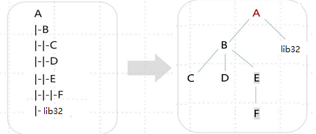

# 删除整个目录

## 题目描述

我们定义一种**目录结构字符串**(类似Windows的tree/f的输出内容)，用它来表达目录树的结构，如图所示：



-   目录结构字符串的输入仅含数字、字母和`|-`，其中：`|-` 表示子目录的层次符号；字母或数字表示目录名。
-   某目录的子目录的顺序**以输入先后顺序为准**。
-   某目录的多个子目录不能同名，如果出现多个，则只保留第一个，后续的输入忽略。
-   无对应的父目录，属于异常情况，直接忽略。

给定一个目录结构字符串，请**按先后顺序删除所有目录**，并依次输出删除的目录名称：

-   如果是叶子目录，直接删除。
-   如果某目录含有子目录，则需要先删除其子目录。

如上图所示的输出为`C D F E B lib32 A`

**解答要求**时间限制：1000ms, 内存限制：64MB

**输入**

首行是一个整数 n，表示目录结构字符串的行数，取值范围 [1, 50)

接下来n行，每行字符串表示一个待处理的目录，目录名长度为[1,10]，整行字符串长度为 [1,100]。

用例保证，有且仅有一个根目录。

**输出**

字符串序列，表示依次删除的目录，目录之间以单空格分隔。

**样例**

输入样例 1

```
10
|-B
A
|-B
|-|-C
|-|-D
|-|-D
|-|-|-|-D
|-|-E
|-|-|-F
|-lib32
```

输出样例 1

```
C D F E B lib32 A
```

提示样例 1

**提示**

样例1解释：

```
|-B     // 非顶层目录，并且它前面无对应的父目录，该行输入被忽略
A     // A为顶层目录
|-B     // B为第二层，它紧跟的上一层目录为A，因此B为A的子目录
|-|-C     // C为第三层，它紧跟的上一层目录为B，因此其父目录为B。
|-|-D     // D为第三层，它紧跟的上一层目录为B，因此其父目录为B，它和C为兄弟关系。
|-|-D     // D为第三层，与先输入的第三层目录D同名，该行输入被忽略。
|-|-|-|-D   // D为第五层，前面没有第四层目录，因此无对应的父目录，该行输入被忽略。
|-|-E      // E为第三层，它紧跟的上一层目录为B，因此其父目录为B，它和C、D为兄弟关系。
|-|-|-F      // F为第四层，它紧跟的上一层目录为E，因此其父目录为E。
|-lib32     // lib32为第二层，它紧跟的上一层目录为A，因此其父目录为A，它与B为兄弟关系。
```

按先后顺序删除时：A有子目录B、lib32，先删除B时，其子目录C、D、E需要被先删除，C、D无子目录直接被删除，E有子目录F则先删除F。以此类推，最终输出为 C D F E B lib32 A