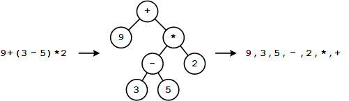

# 表达式计算

## 题目描述

四则运算表达式可用表达式树来表达，如图所示。 图中最右边部分是该表达式树的后序遍历（后序遍历是指先遍历左子树，再遍历右子树，最后访问节点本身，简写 LRN）。


现给你一个字符串，代表一个后序遍历形式的四则运算表达式，请计算出表达式的结果（只输出整数部分）。

>   注：
>
>   -   都是双目运算，不存在单目运算;
>   -   中间计算结果范围：[-2^31, 2^31)；
>   -   除法只需保留整数部分，比如:5/4=1, (-5)/3=-1, 5/(-3)=-1，无需考虑余数；无需考虑除数为0的情况，用例不存在除零。

**解答要求**时间限制：1000ms, 内存限制：64MB

**输入**

一个字符串，代表一个四则运算表达式，由若干操作数和运算符组成，操作数、运算符之间都用一个逗号隔开。长度范围：[1,50000)。

注：用例保证输入合法：1）一定有计算结果； 2）操作数是合法的整数； 3）运算符只包含`+`，`-`，`*`，`/`四种。

**输出**

一个整数，表示表达式的计算结果，用例保证最终结果范围：-2,147,483,648 ~ 2,147,483,647。

**样例**

输入样例 1

```
9,3,5,-,2,*,+
```

输出样例 1

```
5
```

提示样例 1

输入样例 2

```
3,-3,-,2,/,10,-
```

输出样例 2

```
-7
```

提示样例 2

**提示**

样例2解释：算式结构为：(3 - (-3)) / 2 - 10 = -7

## 解答

```
import java.nio.charset.StandardCharsets;
import java.util.Scanner;
import java.util.Stack;

public class Main {
    private static Stack numsstack = new Stack<>();

    // main入口由OJ平台调用
    public static void main(String[] args) {
        Scanner cin = new Scanner(System.in, StandardCharsets.UTF_8.name());
        String expression = cin.nextLine();
        cin.close();

        int result = calcExpression(expression);
        System.out.println(result);
    }

    private static int calcExpression(String expression) {
        String[] exprs = expression.split(",");
        for (String expr : exprs) {
            if (expr.equals("+") || expr.equals("-") || expr.equals("*") || expr.equals("/")) {
                //opertstack.add(expr);
                // 弹出numstack的前两个值进行计算
                int num1 = Integer.parseInt((String) numsstack.pop());
                int num2 = Integer.parseInt((String) numsstack.pop());
                String result = Integer.toString(calcExpr(num1, num2, expr));
                numsstack.push(result);
            } else {
                numsstack.add(expr);
            }
        }
        return Integer.parseInt((String) numsstack.pop());
    }

    private static int calcExpr(int num1, int num2, String oper) {
        switch (oper) {
            case "+":
                return num1 + num2;
            case "-":
                return num2 - num1;
            case "*":
                return num2 * num1;
            case "/":
                return num2 / num1;
            default:
                return -1;
        }
    }
}
```