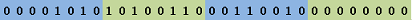
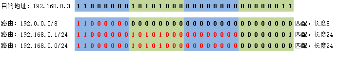

# 路由表最长匹配

## 题目描述

路由表最长匹配是IP(v4) 路由器的最基本的功能之一：当路由器收到一个IP数据包时，会将数据包的目的IP地址与本地路由表进行匹配：

-   格式：目的IP地址为`dstIP`，路由表中每条路由为`entryIP/掩码长度m`，如 `10.166.50.0/23`。 注：所有IP地址以**点分十进制**字符串表示。
-   匹配规则：
    -   如果 entryIP 和 dstIP 的**二进制表示**的**前 m 个**bit相同，则说明该条路由是匹配的。注：`10.166.50.0`的二进制表示如下：
    -   `0.0.0.0/0`是默认路由，它与任何目的IP地址都是匹配的，m 值为 0 。
    -   所有匹配的路由中，m 最大的即为“最长匹配”。

现给出目的IP地址和本地路由表，请输出最长匹配的路由；如果有多条，则**按给出的先后顺序**输出最先的；如果没有匹配的，输出字符串`empty`。

**解答要求**时间限制：1000ms, 内存限制：256MB

**输入**

-   第一行是目的IP地址，点分十进制表示的字符串。
-   第二行一个整数 n，表示路由表中的路由数量，取值范围为 [1, 10000]。
-   接下来 n 行表示 n 条路由，其中掩码长度 m 的取值范围为[0, 32]，m 值为 0 **仅存在于**路由 0.0.0.0/0 。

**输出**

最长匹配的路由，格式同输入；如果没有则输出字符串`empty`。

**样例**

输入样例 1

```
192.168.0.3
6
10.166.50.0/23
192.0.0.0/8
10.255.255.255/32
192.168.0.1/24
127.0.0.0/8
192.168.0.0/24
```

输出样例 1

```
192.168.0.1/24
```

提示样例 1

匹配的路由如下图所示，先按匹配的长度，再按输入先后顺序，结果为192.168.0.1/24



输入样例 2

```
202.96.96.68
1
200.18.24.0/24
```

输出样例 2

```
empty
```

提示样例 2

输入样例 3

```
10.110.32.77
2
127.0.0.1/8
0.0.0.0/0
```

输出样例 3

```
0.0.0.0/0
```

提示样例 3

127.0.0.1/8 不匹配； 0.0.0.0/0 是默认路由，是匹配的，且是唯一匹配的。

**提示**

注：可以用十进制数**掩码长度**来简单表示一个子网掩码，掩码长度指的是二进制子网掩码中连续1的个数，例如掩码长度 24 表示子网掩码的二进制形式为11111111.11111111.11111111.00000000(十进制形式为：255.255.255.0； 长度24不包括分隔符点），掩码长度 27 表示子网掩码的二进制形式为11111111.11111111.11111111.11100000（十进制形式为255.255.255.224）