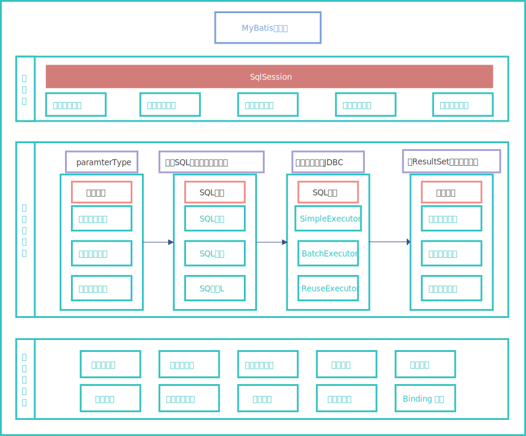

# 整体架构

MyBatis 的整体架构分为三层， 分别是基础支持层、核心处理层和接口层：

三层对应的包：

- 界面层：controller包（servlet）
- 业务逻辑层：service包（XXXService类）
- 数据访问层：dao包（XXXDao类）

三层对应的处理框架:

- 接口层--controller类 -- springmvc（框架）
- 核心处理层--service类 -- spring（框架）
- 基础支持层--dao类 -- mybatis（框架）

基础支持层：

| 模块         | 功能                                                         |
| ------------ | ------------------------------------------------------------ |
| 反射模块     | 该模块对Java 原生的反射进行了良好的封装，提供了更加简洁易用的API ，方便上层使调用，并且对反射操作进行了一系列优化，例如缓存了类的元数据，提高了反射操作的性能。 |
| 类型转换模块 | 别名机制， 该机制是类型转换模块的主要功能之一。实现JDBC 类型与Java 类型之间的转换，该功能在为SQL 语句绑定实参以及映射查询结果集时都会涉及。 |
| 日志模块     | 提供详细的日志输出信息；能够集成多种日志框架，其日志模块的一个主要功能就是集成第三方日志框架。 |
| 资源加载模块 | 对类加载器进行封装，确定类加载器的使用顺序，并提供了加载类文件以及其他资源文件的功能。 |
| 解析器模块   | 对XPath 进行封装，为MyBatis 初始化时解析mybatis-config.xml 配置文件以及映射配置文件提供支持;为处理动态SQL 语句中的占位符提供支持。 |
| 数据源模块   | 本身提供了相应的数据源实现;提供了与第三方数据源集成的接口。  |
| 事务管理     | MyBatis 对数据库中的事务进行了抽象,其自身提供了相应的事务接口和简单实现。 |
| 缓存模块     | MyBatis 中提供了一级缓存和二级缓存，而这两级缓存都是依赖于基础支持层中的缓存模块实现的。 MyBatis 中自带的这两级缓存与MyBatis 以及整个应用是运行在同一个JVM中的，共享同一块堆内存。 如果这两级缓存中的数据量较大， 则可能影响系统中其他功能的运行，所以当需要缓存大量数据时，优先考虑使用Redis 、Memcache 等缓存产品。 |
| Binding 模块 | MyBatis 通过Binding 模块将用户自定义的Mapper 接口与映射配置文件关联起来，系统可以通过调用自定义Mapper 接口中的方法执行相应的SQL 语句完成数据库操作，尽早发现拼写错误。 开发人员无须编写自定义Mapper 接口的实现， MyBatis 会自动为其创建动态代理对象。 |
