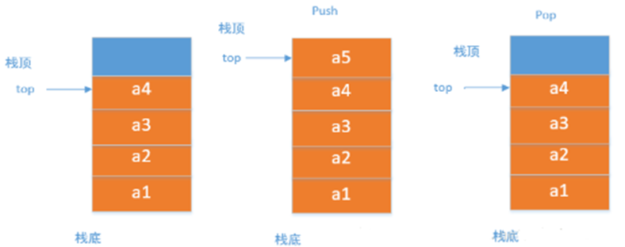

# 栈

限制仅在表的一端进行插入和删除运算的线性表，先进后出（FILO）


Java栈的基本操作：

```
Stack<Integer> stack = new Stack<Integer>();
```

-   pop() 出栈操作，弹出栈顶元素。
-   push(E e) 入栈操作
-   peek() 查看栈顶元素
-   isEmpty() 栈为空
-   search(Object o) 返回对象在堆栈的位置，以1为基数

## 顺序栈



## 链式栈

