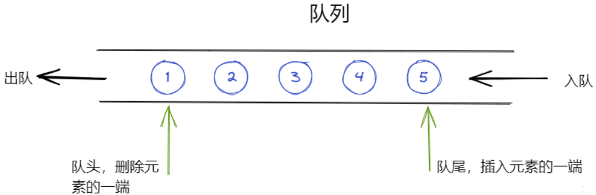
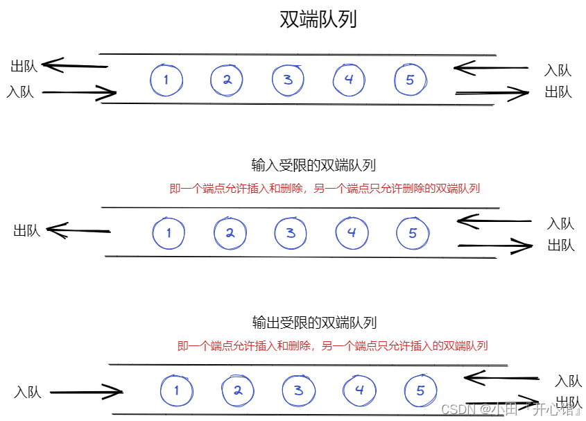

# 队列

和栈相反，队列(queue)是一种先进先出(first in first out)的线性表（缩写为FIFO）。它只允许在表的一端进行插入，在另一端进行删除元素。这种数据结构概括起来就和我们平时排队是一样的道理，最早进入到的队列的元素最先离开。





队列是典型的 FIFO 数据结构。新元素始终被添加在队列的末尾。

Java中队列基本操作

| 操作    | 动作                     | 行为                                               |
| ------- | ------------------------ | -------------------------------------------------- |
| offer   | 添加一个元素并返回true   | 如果队列已满，则返回false                          |
| poll    | 移除并返问队列头部的元素 | 如果队列为空，则返回null                           |
| peek    | 返回队列头部的元素       | 如果队列为空，则返回null                           |
| add     | 增加一个元索             | 如果队列已满，则抛出一个IIIegaISlabEepeplian异常   |
| remove  | 移除并返回队列头部的元素 | 如果队列为空，则抛出一个NoSuchElementException异常 |
| element | 返回队列头部的元素       | 如果队列为空，则抛出一个NoSuchElementException异常 |

## 顺序队列

## 链式队列

## 循环队列

## 双端队列

## 优先队列

-   一种不必遵循队列先进先出(FIFO)特性的特殊队列
-   每次入队时，都会按照入队数据项的关键值进行排序(从大到小、从小到大)，这样保证了关键字最小的或者最大的项始终在队头，出队的时候优先级最高的就最先出队

Java对应实现

```
Queue<Integer> queue = new PriorityQueue<Integer>();
```
