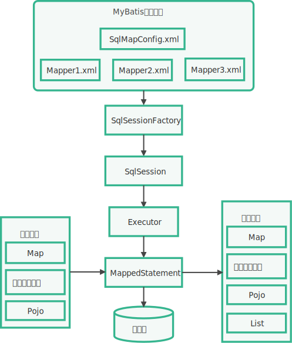
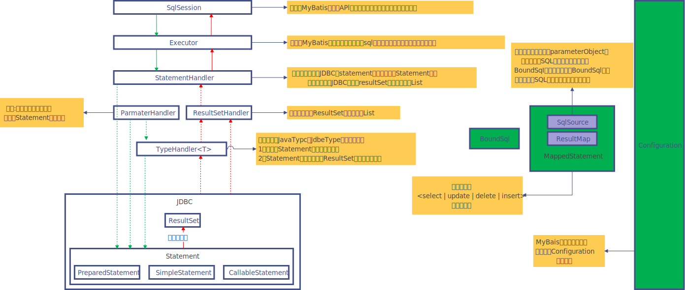

# MyBatis的启动流程

1.  加载Mapper配置的SQL映射文件，或者注解的相关SQL内容。
2.  创建会话工厂。MyBatis通过读取配置文件的数据源信息来构造会话工厂（SqlSessionFactory）。
3.  创建会话。MyBatis可以通过会话工厂来创建会话对象（SqlSession），会话对象是一个接口，该接口中包含对数据库操作的增、删、改、查方法。
4.  创建执行器。因为会话对象本身不能直接操作数据库，所以它使用了一个叫作数据库执行器（Executor）的接口来帮它执行操作。
5.  封装SQL对象。在这一步，执行器将待处理的SQL信息封装到一个对象（MappedStatement）中，该对象包括SQL语句、输入参数映射信息（Java简单类型、HashMap或POJO）和输出结果映射信息。
6.  操作数据库。拥有了执行器和SQL信息封装对象就可以使用它们访问数据库，最后返回操作结果，结束流程。

调用流程图：

