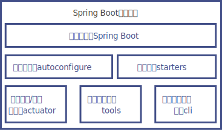

# Spring Boot简介

## Spring Boot的核心组件

Spring Boot官方提供了很多当前流行的基础功能组件的封装，命名一般以spring-boot-starter开头，比如spring-boot-starter-quartz定时任务组件和spring-boot-starter-thymeleaf页面模板引擎等。

另外，由于Spring Boot的流行，很多第三方中间件也按照Spring Boot的规范提供了针对Spring Boot项目的Starters（启动器），一般以组件名开头，比如MyBatis针对Spring Boot提供的组件包mybatis-spring-boot-starter。

Spring Boot的核心组件如图所示。

## 什么是“约定优于配置”

Spring Boot的核心设计思想是“约定优于配置”。

“约定优于配置”也被称作“按约定编程”，是一种软件设计范式，旨在减少软件开发者需要的配置项，这样既能使软件保持简单而又不失灵活性。

从本质上来说，系统、类库或框架应该约定合理的默认值，开发者仅需规定应用中不符合约定的部分。例如，如果模型中有一个名为Product的类，那么数据库中对应的表就会默认命名为product，只有在偏离这个约定时才需要定义有关这个名字的配置，例如将该表命名为product_info。

简单来说“约定优于配置”就是遵循约定。如果你所用工具的约定配置符合你的要求，那么就可以省去此配置；不符合，就通过修改相关的配置来达到你所期待的方式。
