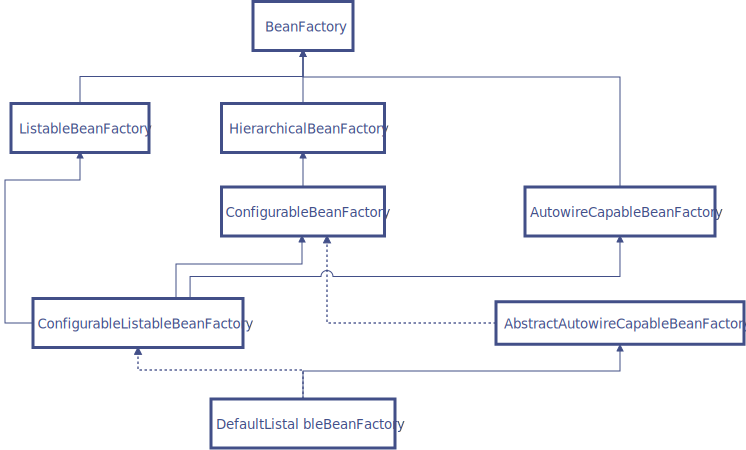

# IOC的原理

Spring 的 IoC 的实现原理就是工厂模式+反射模式。

Spring IoC容器通过XML，注解等其他方式配置类及类之间的依赖关系，完成了对象的创建和依赖的管理注入。实现IoC的主要设计模式是工厂模式。

BeanFactory接口是Spring IoC 容器的核心接口。org.springframework.beans.factory.BeanFactory 是Spring IoC容器的具体实现，用来包装和管理前面提到的各种bean。

BeanFactory 接口提供了一个先进的配置机制，使得任何类型的对象的配置成为可能。ApplicationContex接口对BeanFactory（是一个子接口）进行了扩展，在BeanFactory的基础上添加了其他功能，比如与Spring的AOP更容易集成，也提供了处理message resource的机制（用于国际化）、事件传播以及应用层的特别配置，比如针对Web应用的WebApplicationContext。

