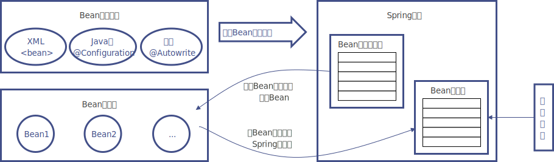

# IoC容器的加载过程

IoC的加载过程就是Bean的创建过程。

首先看一张图：

详细过程如下：

Spring IoC容器的加载，大体上可以分为以下几个过程：资源文件定位，解析，注册，实例化。

-   资源文件定位：一般是在ApplicationContext的实现类里完成的。因为ApplicationContext接口继承ResourcePatternResolver 接口，ResourcePatternResolver接口继承ResourceLoader接口，ResourceLoader其中的getResource()方法，可以将外部的资源，读取为Resource类。

-   解析。解析主要是在BeanDefinitionReader中完成的，最常用的实现类是XmlBeanDefinitionReader，其中的loadBeanDefinitions()方法，负责读取Resource，并完成后续的步骤。

    ApplicationContext完成资源文件定位之后，是将解析工作委托给XmlBeanDefinitionReader来完成的， 解析这里涉及到很多步骤，最常见的情况，资源文件来自一个XML配置文件。首先是BeanDefinitionReader，将XML文件读取成w3c的Document文档。

    DefaultBeanDefinitionDocumentReader对Document进行进一步解析。然后DefaultBeanDefinitionDocumentReader又委托给BeanDefinitionParserDelegate进行解析。如果是标准的xml namespace元素，会在Delegate内部完成解析，如果是非标准的xml namespace元素，则会委托合适的NamespaceHandler进行解析最终解析的结果都封装为BeanDefinitionHolder，至此解析就算完成。

-   注册：Bean的注册是在BeanFactory里完成的，BeanFactory接口最常见的一个实现类是DefaultListableBeanFactory，它实现了BeanDefinitionRegistry接口，所以其中的registerBeanDefinition()方法，可以对BeanDefinition进行注册这里附带一提，最常见的XmlWebApplicationContext不是自己持有BeanDefinition的，它继承自AbstractRefreshableApplicationContext，其持有一个DefaultListableBeanFactory的字段，就是用它来保存BeanDefinition 所谓的注册，其实就是将BeanDefinition的name和实例，保存到一个Map中。

-   实例化：注册也完成之后，在BeanFactory的getBean()方法之中，会完成初始化，也就是依赖注入的过程 大体上的流程就是这样。

流程如下：

