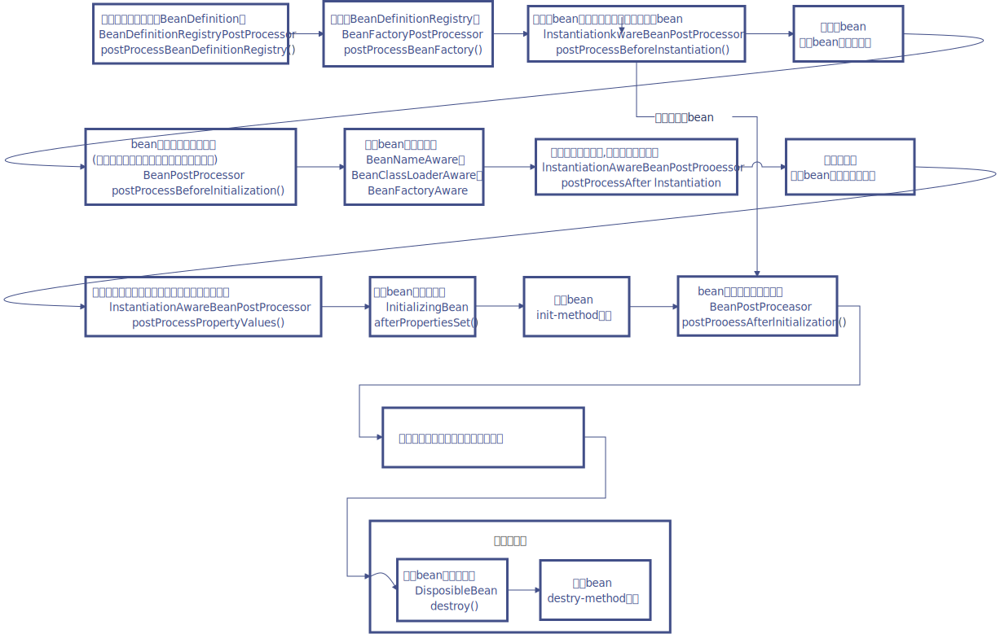

# IoC扩展点

## Spring IoC有哪些扩展点，在什么时候调用？

对 Spring 的 Ioc 容器来说，主要有：BeanFactoryPostProcessor， BeanPostProcessor。他们分别是在构建 BeanFactory和构建 Bean 对象时调用。还有就是InitializingBean 和DisposableBean， 他们分别是在 Bean 实例创建和销毁时被调用。用户可以实现这些接口中定义的方法，Spring 就会在适当的时候调用他们。还有一个是 FactoryBean 它是个特殊的 Bean，这个 Bean 可以被用户更多的控制。

这些扩展点通常也是我们使用Spring来完成特定任务的地方。

**1. BeanDefinitionRegistryPostProcessor接口**

**BeanDefinitionRegistryPostProcessor接口继承了BeanFactoryPostProcessor接口，作用是动态注册BeanDefinition**，调用时机是在IoC加载时注册BeanDefinition的时候

```
/**
 * Extension to the standard {@link BeanFactoryPostProcessor} SPI, allowing for
 * the registration of further bean definitions <i>before</i> regular
 * BeanFactoryPostProcessor detection kicks in. In particular,
 * BeanDefinitionRegistryPostProcessor may register further bean definitions
 * which in turn define BeanFactoryPostProcessor instances.
 *
 * @author Juergen Hoeller
 * @since 3.0.1
 * @see org.springframework.context.annotation.ConfigurationClassPostProcessor
 */
public interface BeanDefinitionRegistryPostProcessor extends BeanFactoryPostProcessor {
    /**
     * Modify the application context's internal bean definition registry after its
     * standard initialization. All regular bean definitions will have been loaded,
     * but no beans will have been instantiated yet. This allows for adding further
     * bean definitions before the next post-processing phase kicks in.
     * @param registry the bean definition registry used by the application context
     * @throws org.springframework.beans.BeansException in case of errors
     */
    void postProcessBeanDefinitionRegistry(BeanDefinitionRegistry registry) throws BeansException;
}
```

这个接口扩展了标准的BeanFactoryPostProcessor接口，允许在普通的BeanFactoryPostProcessor接口实现类执行之前注册更多的BeanDefinition。特别是BeanDefinitionRegistryPostProcessor可以注册BeanFactoryPostProcessor的BeanDefinition.

postProcessBeanDefinitionRegistry方法可以修改在BeanDefinitionRegistry接口实现类中注册的任意BeanDefinition，也可以增加和删除BeanDefinition。原因是这个方法执行前所有常规的BeanDefinition已经被加载到BeanDefinitionRegistry接口实现类中，但还没有Bean被实例化。示例：

```
import org.slf4j.Logger;
import org.slf4j.LoggerFactory;
import org.springframework.beans.BeansException;
import org.springframework.beans.factory.config.ConfigurableListableBeanFactory;
import org.springframework.beans.factory.support.BeanDefinitionRegistry;
import org.springframework.beans.factory.support.BeanDefinitionRegistryPostProcessor;

@Component
public class MyBeanDefinitionRegistryPostProcessor implements BeanDefinitionRegistryPostProcessor {
    private Logger logger = LoggerFactory.getLogger("MyBeanDefinitionRegistryPostProcessor");

    @Override
    public void postProcessBeanDefinitionRegistry(BeanDefinitionRegistry beanDefinitionRegistry) throws BeansException {
        logger.info("BeanDefinitionRegistryPostProcessor的postProcessBeanDefinitionRegistry方法,在这里可以增加修改删除bean的定义");
    }
    @Override
    public void postProcessBeanFactory(ConfigurableListableBeanFactory configurableListableBeanFactory) throws BeansException {
        logger.info("BeanDefinitionRegistryPostProcessor的postProcessBeanFactory方法,在这里可以对beanFactory做一些操作");
    }
}
```

实际上，Mybatis中org.mybatis.spring.mapper.MapperScannerConfigure就实现了该方法，在只有接口没有实现类的情况下找到接口方法与SQL之间的联系从而生成BeanDefinition并注册。而Spring的org.springframework.context.annotation.ConfigurationClassPostProcessor也是用来将注解@Configuration中的相关生成bean的方法所对应的BeanDefinition进行注册。

**2. BeanFactoryPostProcessor接口**

BeanFactory生成后，如果想要对BeanFactory做一些处理，可以使用BeanFactoryPostProcessor接口。换句话说，就是在注册BeanDefinition的时候可以对beanFactory进行扩展。调用时机是在Ioc加载时注册BeanDefinition的时候调用。

```
/**
 * Allows for custom modification of an application context's bean definitions,
 * adapting the bean property values of the context's underlying bean factory.
 *
 * <p>Application contexts can auto-detect BeanFactoryPostProcessor beans in
 * their bean definitions and apply them before any other beans get created.
 *
 * <p>Useful for custom config files targeted at system administrators that
 * override bean properties configured in the application context.
 *
 * <p>See PropertyResourceConfigurer and its concrete implementations
 * for out-of-the-box solutions that address such configuration needs.
 *
 * <p>A BeanFactoryPostProcessor may interact with and modify bean
 * definitions, but never bean instances. Doing so may cause premature bean
 * instantiation, violating the container and causing unintended side-effects.
 * If bean instance interaction is required, consider implementing
 * {@link BeanPostProcessor} instead.
 *
 * @author Juergen Hoeller
 * @since 06.07.2003
 * @see BeanPostProcessor
 * @see PropertyResourceConfigurer
 */
public interface BeanFactoryPostProcessor {
    /**
     * Modify the application context's internal bean factory after its standard
     * initialization. All bean definitions will have been loaded, but no beans
     * will have been instantiated yet. This allows for overriding or adding
     * properties even to eager-initializing beans.
     * @param beanFactory the bean factory used by the application context
     * @throws org.springframework.beans.BeansException in case of errors
     */
    void postProcessBeanFactory(ConfigurableListableBeanFactory beanFactory) throws BeansException;
}
```

该接口允许自定义修改应用程序上下文的BeanDefinition，调整上下文的BeanFactory的bean属性值。应用程序上下文可以在BeanFactory的BeanDefinition中自动检测BeanFactoryPostProcessor bean，并在创建任何其他bean之前应用它们。

BeanFactoryPostProcessor可能与bean定义交互并修改，但永远不应该将bean实例化。 这样做可能会导致过早的bean实例化，违反容器执行顺序并导致意想不到的副作用。

postProcessBeanFactory方法在BeanFactory初始化后，所有的bean定义都被加载，但是没有bean会被实例化时，允许重写或添加属性。

DefaultBeanDefinitionRegistryPostProcessor接口一样，实现并配置到spring的xml配置中即可。最常用的一个应用就是org.springframework.beans.factory.config.PropertyPlaceholderConfigurer，BeanDefinition生成后，可能某些参数是${key}，这个实现类就是把参数占位符转换成xxx.properties中key所对应的值。

**在Bean的生命周期过程中会调用9次Bean的后置处理器**。

除了上面的扩展接口，还有：

-   在初始化阶段调用XXXAware接口的SetXXXAware方法；

生命周期回调：

-   执行BeanPostProcessor实现类的postProcessBeforeInitialization方法
-   执行InitializingBean实现类的afterPropertiesSet方法
-   执行bean的init-method属性指定的初始化方法
-   执行BeanPostProcessor实现类的postProcessAfterInitialization方法
-   初始化完成
-   关闭容器，执行DisposibleBean实现类distory
-   执行bean的destory-method属性指定的初始化方法

## Spring的扩展点中的接口是怎么在Spring中生效的？

换句话说，也就是扩展点在什么时候被调用或者被添加到BeanFactory中等待调用呢？

首先从**容器级别**分析，重点关注上下文的抽象类AbstractApplicationContext#refresh方法，源码如下：

```
@Override
public void refresh() throws BeansException, IllegalStateException {
    synchronized (this.startupShutdownMonitor) {
        // Prepare this context for refreshing.
        // 设置上下文启动时间和活跃标记，同时加载属性资源。
        prepareRefresh();

        // Tell the subclass to refresh the internal bean factory.
        // 停掉之前启动的beanFactory如果有的话，同时新生成一个beanFactory，加载配置中的BeanDefinition。
        ConfigurableListableBeanFactory beanFactory = obtainFreshBeanFactory();

        // Prepare the bean factory for use in this context.
        // 给beanFactory设置类加载器，添加后置处理器`ApplicationContextAwareProcessor`等等。
        prepareBeanFactory(beanFactory);
        try {
            // Allows post-processing of the bean factory in context subclasses.
            postProcessBeanFactory(beanFactory);

            // Invoke factory processors registered as beans in the context.
            invokeBeanFactoryPostProcessors(beanFactory);

            // Register bean processors that intercept bean creation.
            registerBeanPostProcessors(beanFactory);

            // Initialize message source for this context.
            initMessageSource();

            // Initialize event multicaster for this context.
            initApplicationEventMulticaster();

            // Initialize other special beans in specific context subclasses.
            onRefresh();

            // Check for listener beans and register them.
            registerListeners();

            // Instantiate all remaining (non-lazy-init) singletons.
            finishBeanFactoryInitialization(beanFactory);

            // Last step: publish corresponding event.
            finishRefresh();
        }

        catch (BeansException ex) {
            if (logger.isWarnEnabled()) {
                logger.warn("Exception encountered during context initialization - " +
                        "cancelling refresh attempt: " + ex);
            }

            // Destroy already created singletons to avoid dangling resources.
            destroyBeans();

            // Reset 'active' flag.
            cancelRefresh(ex);

            // Propagate exception to caller.
            throw ex;
        }

        finally {
            // Reset common introspection caches in Spring's core, since we
            // might not ever need metadata for singleton beans anymore...
            resetCommonCaches();
        }
    }
}
```

其中**invokeBeanFactoryPostProcessors方法的调用逻辑是**：

-   如果beanFactory是BeanDefinitionRegistry的实现类，拿到入参所有的BeanFactoryPostProcessor接口实现类，挑选出实现BeanDefinitionRegistryPostProcessor接口的实现类先执行postProcessBeanDefinitionRegistry方法。

-   然后调用beanFactory中实现BeanDefinitionRegistryPostProcessor接口的实现类中实现PriorityOrdered接口的实现类，调用这些实现类前先根据PriorityOrdered的getOrder方法进行排序，然后再按顺序调用postProcessBeanDefinitionRegistry方法。

-   接着再调用beanFactory中实现BeanDefinitionRegistryPostProcessor接口的实现类中实现了Ordered接口的类，也是按顺序调用postProcessBeanDefinitionRegistry方法。

-   最后调用beanFactory中其他的实现BeanDefinitionRegistryPostProcessor接口的实现类的postProcessBeanDefinitionRegistry方法。

-   最终先调用入参中所有实现BeanDefinitionRegistryPostProcessor接口的实现类的postProcessBeanFactory方法，再调用入参中实现了BeanFactoryPostProcessor接口的实现类的postProcessBeanFactory方法。

-   如果不是则只把入参中的BeanFactoryPostProcessor实现类全部调用一遍。

-   上边都做完了，接着从beanFactory中获取实现了BeanFactoryPostProcessor接口的bean（没有被执行过），也是分为三类，PriorityOrdered组优先调用，Ordered其次，其他垫底。
-   最终清除beanFactory的metaData缓存

**registerBeanPostProcessors方法的调用逻辑是**：

-   首先添加BeanPostProcessorChecker；
-   然后把beanFactory中实现BeanPostProcessor接口的实现类分成四个部分分别添加到beanFactory：
    -   PriorityOrdered部分，实现了PriorityOrdered接口且并不属于MergedBeanDefinitionPostProcessor的
    -   Ordered部分，实现了Ordered接口且并不属于MergedBeanDefinitionPostProcessor的
    -   其他的不属于MergedBeanDefinitionPostProcessor的
    -   属于MergedBeanDefinitionPostProcessor的
    -   其中PriorityOrdered和Ordered部分先排序，然后按上边的顺序分别加入到beanFactory的beanPostProcessors属性中

然后考虑bean级别，其余的bean上的接口属性之类的，都是在bean的生成中逐个调用的。

下图是扩展点之间的调用顺序：



## Bean实例化中有哪些扩展？

InstantiationAwareBeanPostProcessor接口

源码如下：

```
/**
 * Subinterface of {@link BeanPostProcessor} that adds a before-instantiation callback,
 * and a callback after instantiation but before explicit properties are set or
 * autowiring occurs.
 *
 * <p>Typically used to suppress default instantiation for specific target beans,
 * for example to create proxies with special TargetSources (pooling targets,
 * lazily initializing targets, etc), or to implement additional injection strategies
 * such as field injection.
 *
 * <p><b>NOTE:</b> This interface is a special purpose interface, mainly for
 * internal use within the framework. It is recommended to implement the plain
 * {@link BeanPostProcessor} interface as far as possible, or to derive from
 * {@link InstantiationAwareBeanPostProcessorAdapter} in order to be shielded
 * from extensions to this interface.
 *
 * @author Juergen Hoeller
 * @author Rod Johnson
 * @since 1.2
 * @see org.springframework.aop.framework.autoproxy.AbstractAutoProxyCreator#setCustomTargetSourceCreators
 * @see org.springframework.aop.framework.autoproxy.target.LazyInitTargetSourceCreator
 */
public interface InstantiationAwareBeanPostProcessor extends BeanPostProcessor {

    /**
     * Apply this BeanPostProcessor <i>before the target bean gets instantiated</i>.
     * The returned bean object may be a proxy to use instead of the target bean,
     * effectively suppressing default instantiation of the target bean.
     * <p>If a non-null object is returned by this method, the bean creation process
     * will be short-circuited. The only further processing applied is the
     * {@link #postProcessAfterInitialization} callback from the configured
     * {@link BeanPostProcessor BeanPostProcessors}.
     * <p>This callback will only be applied to bean definitions with a bean class.
     * In particular, it will not be applied to beans with a "factory-method".
     * <p>Post-processors may implement the extended
     * {@link SmartInstantiationAwareBeanPostProcessor} interface in order
     * to predict the type of the bean object that they are going to return here.
     * @param beanClass the class of the bean to be instantiated
     * @param beanName the name of the bean
     * @return the bean object to expose instead of a default instance of the target bean,
     * or {@code null} to proceed with default instantiation
     * @throws org.springframework.beans.BeansException in case of errors
     * @see org.springframework.beans.factory.support.AbstractBeanDefinition#hasBeanClass
     * @see org.springframework.beans.factory.support.AbstractBeanDefinition#getFactoryMethodName
     */
    Object postProcessBeforeInstantiation(Class<?> beanClass, String beanName) throws BeansException;

    /**
     * Perform operations after the bean has been instantiated, via a constructor or factory method,
     * but before Spring property population (from explicit properties or autowiring) occurs.
     * <p>This is the ideal callback for performing custom field injection on the given bean
     * instance, right before Spring's autowiring kicks in.
     * @param bean the bean instance created, with properties not having been set yet
     * @param beanName the name of the bean
     * @return {@code true} if properties should be set on the bean; {@code false}
     * if property population should be skipped. Normal implementations should return {@code true}.
     * Returning {@code false} will also prevent any subsequent InstantiationAwareBeanPostProcessor
     * instances being invoked on this bean instance.
     * @throws org.springframework.beans.BeansException in case of errors
     */
    boolean postProcessAfterInstantiation(Object bean, String beanName) throws BeansException;

    /**
     * Post-process the given property values before the factory applies them
     * to the given bean. Allows for checking whether all dependencies have been
     * satisfied, for example based on a "Required" annotation on bean property setters.
     * <p>Also allows for replacing the property values to apply, typically through
     * creating a new MutablePropertyValues instance based on the original PropertyValues,
     * adding or removing specific values.
     * @param pvs the property values that the factory is about to apply (never {@code null})
     * @param pds the relevant property descriptors for the target bean (with ignored
     * dependency types - which the factory handles specifically - already filtered out)
     * @param bean the bean instance created, but whose properties have not yet been set
     * @param beanName the name of the bean
     * @return the actual property values to apply to the given bean
     * (can be the passed-in PropertyValues instance), or {@code null}
     * to skip property population
     * @throws org.springframework.beans.BeansException in case of errors
     * @see org.springframework.beans.MutablePropertyValues
     */
    PropertyValues postProcessPropertyValues(
            PropertyValues pvs, PropertyDescriptor[] pds, Object bean, String beanName) throws BeansException;

}
```

该接口是BeanPostProcessor的子接口，用于在实例化之后，但在设置显示属性或自动装配之前，设置实例化之前的回调函数。通常用于抑制特定目标bean的默认实例化。例如创建具有特殊TargetSource(池化目标，延迟初始化目标等)的代理，或者实现其他注册策略，如字段注入。

注意，该接口是一个专用接口，主要用于框架内的内部使用。建议尽可能实现简单的BeanPostProcessor接口，或者从InstantiationAwareBeanPostProcessoeAdapter派生，以便屏蔽此接口的扩展。

postProcessBeforeInstantiation方法，在目标bean实例化之前创建bean，如果在这里创建了bean，则不会走默认的实例化过程，通常用来创建代理。注意工厂方法生成的bean不会走这个方法。

postProcessAfterInstantiation方法，在目标bean实例化后，但是没有进行属性填充前执行的方法。

postProcessPropertyValues方法，在将给定属性值设置到到给定的bean后，对其进行后处理。 允许检查所有的依赖关系是否被满足，例如基于bean属性设置器上的“Required”注解。还允许替换要应用的属性值，通常通过创建基于原始PropertyValues的新MutablePropertyValues实例，添加或删除特定值。

这个接口Spring不建议用户直接实现，如果必须在这些扩展点应用自己的回调函数，spring建议继承InstantiationAwareBeanPostProcessorAdapter，重写相应的方法即可。

org.springframework.aop.framework.autoproxy.BeanNameAutoProxyCreator，基于beanName创建代理，就是应用了这个接口，在生成bean前生成代理bean，从而替代默认的实例化。

**BeanPostProcessor接口**

源码如下：

```
/**
 * Factory hook that allows for custom modification of new bean instances,
 * e.g. checking for marker interfaces or wrapping them with proxies.
 *
 * <p>ApplicationContexts can autodetect BeanPostProcessor beans in their
 * bean definitions and apply them to any beans subsequently created.
 * Plain bean factories allow for programmatic registration of post-processors,
 * applying to all beans created through this factory.
 *
 * <p>Typically, post-processors that populate beans via marker interfaces
 * or the like will implement {@link #postProcessBeforeInitialization},
 * while post-processors that wrap beans with proxies will normally
 * implement {@link #postProcessAfterInitialization}.
 *
 * @author Juergen Hoeller
 * @since 10.10.2003
 * @see InstantiationAwareBeanPostProcessor
 * @see DestructionAwareBeanPostProcessor
 * @see ConfigurableBeanFactory#addBeanPostProcessor
 * @see BeanFactoryPostProcessor
 */
public interface BeanPostProcessor {

    /**
     * Apply this BeanPostProcessor to the given new bean instance <i>before</i> any bean
     * initialization callbacks (like InitializingBean's {@code afterPropertiesSet}
     * or a custom init-method). The bean will already be populated with property values.
     * The returned bean instance may be a wrapper around the original.
     * @param bean the new bean instance
     * @param beanName the name of the bean
     * @return the bean instance to use, either the original or a wrapped one;
     * if {@code null}, no subsequent BeanPostProcessors will be invoked
     * @throws org.springframework.beans.BeansException in case of errors
     * @see org.springframework.beans.factory.InitializingBean#afterPropertiesSet
     */
    Object postProcessBeforeInitialization(Object bean, String beanName) throws BeansException;

    /**
     * Apply this BeanPostProcessor to the given new bean instance <i>after</i> any bean
     * initialization callbacks (like InitializingBean's {@code afterPropertiesSet}
     * or a custom init-method). The bean will already be populated with property values.
     * The returned bean instance may be a wrapper around the original.
     * <p>In case of a FactoryBean, this callback will be invoked for both the FactoryBean
     * instance and the objects created by the FactoryBean (as of Spring 2.0). The
     * post-processor can decide whether to apply to either the FactoryBean or created
     * objects or both through corresponding {@code bean instanceof FactoryBean} checks.
     * <p>This callback will also be invoked after a short-circuiting triggered by a
     * {@link InstantiationAwareBeanPostProcessor#postProcessBeforeInstantiation} method,
     * in contrast to all other BeanPostProcessor callbacks.
     * @param bean the new bean instance
     * @param beanName the name of the bean
     * @return the bean instance to use, either the original or a wrapped one;
     * if {@code null}, no subsequent BeanPostProcessors will be invoked
     * @throws org.springframework.beans.BeansException in case of errors
     * @see org.springframework.beans.factory.InitializingBean#afterPropertiesSet
     * @see org.springframework.beans.factory.FactoryBean
     */
    Object postProcessAfterInitialization(Object bean, String beanName) throws BeansException;

}
```

这个接口允许自定义修改新的bean实例，例如检查标记接口或用代理包装，注意，如果有相互依赖的bean，这里可能无法使用代理。

postProcessBeforeInitialization方法，在任何bean初始化回调（如InitializingBean的afterPropertiesSet或自定义init方法）之前，将此BeanPostProcessor应用于给定的新的bean实例。 这个bean已经被填充了属性值。 返回的bean实例可能是原始的包装器。

postProcessAfterInitialization方法，在Bean初始化回调（如InitializingBean的afterPropertiesSet或自定义init方法）之后，将此BeanPostProcessor应用于给定的新bean实例。 这个bean已经被填充了属性值。 返回的bean实例可能是原始的包装器。这个方法也会在InstantiationAwareBeanPostProcessor#postProcessBeforeInstantiation方法生成对象后再次不让他生成对象

org.springframework.context.support.ApplicationContextAwareProcessor就是在bean初始化回调之前，注入应用上下文的。

3.InitializingBean接口
在执行完BeanPostProcessor的postProcessBeforeInitialization方法后，如果这个bean实现了InitializingBean接口，则会去调用afterPropertiesSet方法。

4.各种Aware

在在执行完BeanPostProcessor的postProcessBeforeInitialization方法前，如果bean实现了BeanNameAware或BeanClassLoaderAware或BeanFactoryAware，则会调用接口相关的方法，入参就是这个bean关心的值。

ApplicationContextAwareProcessor，作用是在一个bean初始化之前，如果这个bean有Aware接口，实现了EnvironmentAware,EmbeddedValueResolverAware，ResourceLoaderAware，ApplicationEventPublisherAware，MessageSourceAware，ApplicationContextAware相关接口，就通过这些aware的相关接口将上下文设置进去，上述接口除了EmbeddedValueResolverAware接口ClassPathXmlApplicationContext没有实现，其他都实现了，也就是说，调用这些接口的方法入参都是ClassPathXmlApplicationContext就可以了。EmbeddedValueResolverAware的入参是EmbeddedValueResolver，它的构造函数入参是上下文中的beanFactory。

5.**BeanDefinition入口扩展**

在定义bean时，可以指定构造函数，设置属性，还可以设置init-method和destroy-method。构造函数不用说，设置属性是在InstantiationAwareBeanPostProcessor#PostProcessPropertyValues方法后执行的，init-method是在InitializingBean的afterPropertiesSet方法后执行的，而destroy-method是在容器关闭是被调用的。
