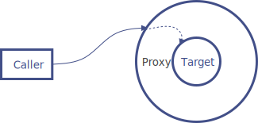
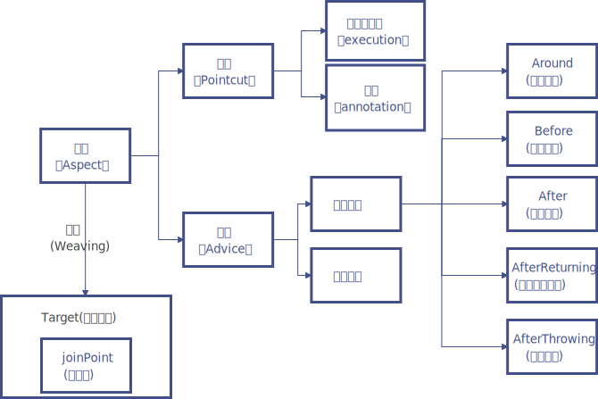
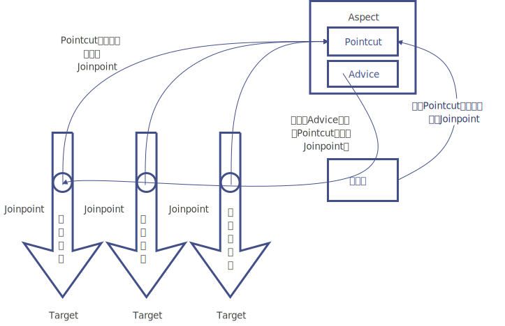

# AOP中的术语

Spring AOP是负责实现切面编程的框架，它将切面所定义的横切逻辑织入切面所指定的连接点中。AOP是一种面向切面的编程，有很多独有的概念，如切面、连接点和通知等，它们组合起来才能完成一个完整的切面逻辑。因此，AOP的工作重心在于如何将增强织入目标对象的连接点上。

## 切面（Aspect）

被抽取出来的公共模块，可以用来会横切多个对象。

切面（Aspect）通常由Pointcut（切点）和Advice（通知）组合而成，一个切面可以由多个切点和通知组成。

通常是定义一个类，并在类中定义Pointcut和Advice。定义的Pointcut用来匹配Join point（连接点），也就是对那些需要被拦截的方法进行定义。定义的Advice用来对被拦截的方法进行增强处理。在Spring AOP中，切面定义可以基于XML配置定义，也可以用@Aspect注解定义。我们可以简单地认为，使用@Aspect注解的类就是一个切面类。

## 连接点（Join point）

指程序运行过程中所执行的方法。在SpringAOP中，一个连接点一般代表一个方法的执行。

## 切点（Pointcut）

切点用于定义 要对哪些连接点（Join point）进行拦截。

切点分为execution方式和annotation方式。execution方式可以用路径表达式指定对哪些方法拦截，比如指定拦截`add*`、`search*`。annotation方式可以指定被哪些注解修饰的代码进行拦截。

>   切点是一种连接点的声明。通知是由切点表达式连接并匹配上切点后再执行的处理逻辑。切点用来匹配特定连接点的表达式，增强处理将会与切点表达式产生关联，并运行在匹配到的连接点上。通过切点表达式匹配连接点是AOP的核心思想。Spring默认使用AspectJ的切点表达式。

## 通知（Advice）

指要在连接点（Join Point）上执行的动作，即增强的逻辑，比如权限校验和、日志记录等。通知有各种类型，包括Around、Before、After、After returning、After throwing。

通知可以分为方法执行前（Before）通知、方法执行后（After）通知和环绕（Around）通知等类型。

Spring AOP的Advice类型如下所示。

-   前置通知（Before Advice）：在连接点（Join point）之前执行的通知。

-   后置通知（After Advice）：当连接点退出的时候执行的通知（不论是正常返回还是异常退出）。 

-   环绕通知（Around Advice）：包围一个连接点的通知，这是最强大的一种通知类型。 环绕通知可以在方法调用前后完成自定义的行为。它也可以选择是否继续执行连接点或直接返回它们自己的返回值或抛出异常来结束执行。

-   返回后通知（AfterReturning Advice）：在连接点正常完成后执行的通知（如果连接点抛出异常，则不执行）

-   抛出异常后通知（AfterThrowing advice）：在方法抛出异常退出时执行的通知

包括Spring AOP在内的许多AOP框架通常会使用拦截器来增强逻辑处理能力，围绕着连接点维护一个拦截器链。

Advice的执行顺序：

（1）没有异常情况下的执行顺序：

-   around before advice
-   before advice
-   target method 执行
-   after advice
-   around after advice
-   afterReturning advice

（2）出现异常情况下的执行顺序：

-   around before advice
-   before advice
-   target method 执行
-   after advice
-   around after advice
-   afterThrowing advice
-   java.lang.RuntimeException：异常发生

## 目标对象（Target）

包含连接点的对象，也称作被通知（Advice）的对象。 由于Spring AOP是通过动态代理实现的，所以这个对象永远是一个代理对象。

目标类（Target Class）是指被切面增强的类。被一个或多个切面增强的对象也叫作增强对象。

## 织入（Weaving）

通过动态代理，在目标对象（Target）的方法（即连接点Join point）中执行增强逻辑（Advice）的过程。

在编译期、加载期和运行期都可以将增强织入（Weaving）目标对象中，但Spring AOP一般是在运行期将其织入目标对象中。织入可以将一个或多个切面与类或对象连接在一起，然后创建一个被增强的对象。

## 引入（Introduction）

添加额外的方法或者字段到被通知的类。Spring允许引入新的接口（以及对应的实现）到任何被代理的对象来增强类的处理能力。例如，你可以使用一个引入来使bean实现 IsModified 接口，以便简化缓存机制。

例如，可以使用引入（Introduction）让一个Bean实现IsModified接口，从而实现一个简单的缓存功能。

几个概念的关系图可以参考下图：

AOP各个概念所处的场景：

