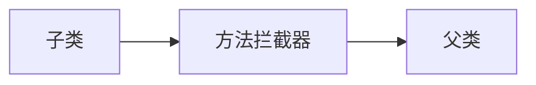

# AOP代理

AOP实现的关键在于代理模式，AOP代理主要分为静态代理和动态代理。静态代理的代表为AspectJ；动态代理则以Spring AOP为代表。

-   AspectJ是静态代理，也称为编译时增强，AOP框架会在编译阶段生成AOP代理类，并将AspectJ(切面)织入到Java字节码中，运行的时候就是增强之后的AOP对象。
-   Spring AOP使用的动态代理，所谓的动态代理就是说AOP框架不会去修改字节码，而是每次运行时在内存中临时为方法生成一个AOP对象，这个AOP对象包含了目标对象的全部方法，并且在特定的切点做了增强处理，并回调原对象的方法。

## Spring AOP代理

Spring AOP中的动态代理主要有两种方式，JDK动态代理和CGLIB动态代理：

1.  JDK动态代理只提供接口的代理，不支持类的代理，要求被代理类实现接口。JDK动态代理的核心是InvocationHandler接口和Proxy类，在获取代理对象时，使用Proxy类来动态创建目标类的代理类（即最终真正的代理类，这个类继承自Proxy并实现了我们定义的接口），当代理对象调用真实对象的方法时， InvocationHandler 通过invoke()方法反射来调用目标类中的代码，动态地将横切逻辑和业务编织在一起；

     InvocationHandler 的 invoke(Object  proxy,Method  method,Object[] args)：proxy是最终生成的代理对象;  method 是被代理目标实例的某个具体方法;  args 是被代理目标实例某个方法的具体入参, 在方法反射调用时使用。

2.  如果被代理类没有实现接口，那么Spring AOP会选择使用CGLIB来动态代理目标类。CGLIB（Code Generation Library），是一个代码生成的类库，可以在运行时动态的生成指定类的一个子类对象，并覆盖其中特定方法并添加增强代码，从而实现AOP。CGLIB是通过继承的方式做的动态代理，因此如果某个类被标记为final，那么它是无法使用CGLIB做动态代理的。

3.  静态代理与动态代理区别在于生成AOP代理对象的时机不同，相对来说AspectJ的静态代理方式具有更好的性能，但是AspectJ需要特定的编译器进行处理，而Spring AOP则无需特定的编译器处理。

Spring AOP是基于动态代理的，如果代理的对象实现了某个接口的话，那么Spring AOP会使用JDK动态代理，对于没有实现某个接口的类，Spring AOP会使用CGLIB动态代理，Spring AOP会使用CGLIB生成一个被代理的子类作为代理。也可以在XML中通过设置proxy-target-class属性来完全使用CGLIB动态代理。

## JDK动态代理和CGLIB动态代理的区别

-   JDk动态代理本质上是实现了被代理的对象的接口，而CGLIB本质是继承了被代理的对象，覆盖其中的方法。
-   JDK动态代理只能对实现了接口的类生成代理，CGLIB则没有这个限制，因此CGLIB可以对没有实现接口的类生成代理，但是CGLIB是继承被代理的对象，所以CGLIB不能对final类、private方法和static方法进行代理。
-   JDK动态代理是JDK自带的，而CGLIB动态代理需要引入第三方jar包，而Spring的核心包中已经继承了CGLIB所使用的包，所以使用Spring进行开发时不需要导入jar包。
-   JDK动态代理是通过发射极致调用，CGLIB是通过FastClass机制直接调用。
-   在性能上，JDK1.7之前，由于使用了FastClass机制，所以CGLIB在执行效率上笔JDK快，但是从JDK1.开始，JDK动态代理已经明显比CGLIB快了。

## 静态代理

静态代理模式的实现比较简单，主要的实现原理是：代理类与被代理类同时实现一个主题接口，代理类持有被代理类的引用。

（1）新建一个公共接口UserInterface，代码如下：

```
public interface UserInterface
{
    //声明方法
    public abstract void getUser();
}
```

（2）定义真实执行类RealUser并实现公共接口UserInterface，代码如下：

```
public class RealUser implements UserInterface
{
    @Override
    public void getUser()
    {
        //新建UserService对象
        System.out.println("真实用户角色执行！");
        UserService userService = new UserService();
        userService.setId(1);
        userService.setName("zhangsan");
        userService.getUser();
    }
}
```

（3）定义代理类UserProxy实现公共接口UserInterface，并持有被代理类的实例。在执行时，调用被代理类（RealUser）实例的getUser()方法。代码如下：

```
//声明UserProxy代理类，并实现UserInterface接口
public class UserProxy implements UserInterface
{
    private UserInterface userInterface;

    //构造方法传入UserInterface类型参数
    public UserProxy(UserInterface userInterface)
    {
        this.userInterface = userInterface;
    }

    //实现getUser()方法，在执行方法前后进行额外操作
    @Override
    public void getUser()
    {
        doBefore();
        userInterface.getUser();
        doAfter();
    }

    //真实方法执行前操作
    private void doBefore()
    {
        System.out.println("代理类开始执行");
    }

    //真实方法执行后操作
    private void doAfter()
    {
        System.out.println("代理类结束执行");
    }
}
```

（4）编写测试代码，具体如下：

```
public class SpringProxyTest
{
    public static void main(String[] args)
    {
        UserInterface realUser = new RealUser();
        //传入真实对象RealUser
        UserProxy userProxy = new UserProxy(realUser);
        userProxy.getUser();
    }
}
```

运行结果如下：

```
代理类开始执行
真实用户角色执行！
id:1
name:zhangsan
代理类结束执行
```

## 动态代理

顾名思义，动态代理是指在程序运行时动态地创建代理类。

动态代理的使用方式主要分为两种：一种是基于接口的代理，另一种则是基于类的代理。基于接口的代理方式是指通过JDK自带的反射类来生成动态代理类；基于类的代理方式则是指通过字节码处理来实现类代理，如CGLIB和Javassist等。

首先我们来看一个基于JDK反射生成代理类的例子。

（1）定义一个公共接口UserServiceInterface，代码如下：

```
public interface UserServiceInterface
{
    public void getUser();
}
```

（2）定义真实用户角色类UserServiceImpl并实现公共接口UserServiceInterface，代码如下：

```
public class UserServiceImpl implements UserServiceInterface
{
    @Override
    public void getUser()
    {
        System.out.println("Testing......");         //实现getUser()方法
    }
}
```

（3）定义代理类UserServiceProxy，实现InvocationHandler接口，并重写invoke()方法，代码如下：

```
import java.lang.reflect.InvocationHandler;
import java.lang.reflect.Method;
import java.lang.reflect.Proxy;

//定义实现InvocationHandler接口的代理类UserServiceProxy
public class UserServiceProxy implements InvocationHandler
{
    private Object target;

    //构造方法
    public UserServiceProxy(Object target)
    {
        this.target = target;
    }

    //通过Proxy动态生成代理类对象
    public <T> T getProxy()
    {
        return (T) Proxy.newProxyInstance(target.getClass().getClassLoader(), target.getClass().getInterfaces(), this);
    }

    //动态执行方法
    @Override
    public Object invoke(Object proxy, Method method, Object[] args) throws Throwable
    {
        System.out.println("JDK before");
        method.invoke(target, args);
        System.out.println("JDK after");
        return null;
    }
}
```

（4）编写测试代码：

```
public class SpringProxyTest
{
    public static void main(String[] args)
    {
        //通过代理类生成UserServiceInterface接口类型对象
        UserServiceInterface userServiceInterface = new UserService;
        Proxy(new UserServiceImpl()).getProxy();
        userServiceInterface.getUser();         //调用getUser()方法
    }
}
```

打印结果如下：

```
JDK proxy before
zhangsan
JDK proxy after
```

通过上面的代理类的执行结果可以看到，真实用户角色类被屏蔽了，只需要暴露接口即可执行成功。屏蔽内部实现的逻辑就是代理模式的特点。

上面主要讲的是基于JDK反射的例子。下面来看一下CGLIB实现动态代理的原理。它是通过继承父类的所有公共方法，然后重写这些方法，并在重写方法时对这些方法进行增强处理来实现的。根据里氏代换原则（LSP），父类出现的地方子类都可以出现，因此CGLIB实现的代理类也是可以被正常使用的。

CGLIB的基本架构如下所示，代理类继承自目标类，每次调用代理类的方法时都会被拦截器拦截，然后在拦截器中调用真实目标类的方法。



CGLIB实现动态代理的方式比较简单，具体如下：

（1）直接实现MethodInterceptor拦截器接口，并重写intercept()方法。代码如下：

```
//继承MethodInterceptor类并实现intercept()方法
public class UserMethodInterceptor implements MethodInterceptor
{
    @Override
    public Object intercept(Object obj, Method method, Object[] args, MethodProxy proxy) throws Throwable
    {
        System.out.println("Cglib before");
        proxy.invokeSuper(obj, args);
        System.out.println("Cglib after");
        return null;
    }
}
```

（2）新建Enhancer类，并设置父类和拦截器类。代码如下：

```
public class Enhancer
{
    public static void main(String[] args)
    {
        Enhancer enhancer = new Enhancer();
        enhancer.setSuperclass(UserServiceImpl.class);    //设置父类
        //设置拦截器
        enhancer.setCallback(new UserMethodInterceptor());
        UserServiceImpl userServiceImpl = (UserServiceImpl) enhancer.create();                                                                                                               //创建对象
        userServiceImpl.getUser();       //调用getUser方法
    }
}
```

打印结果如下：

```
Cglib before
zhangsan
Cglib after
```

JDK实现动态代理是基于接口，其中，目标类与代理类都继承自同一个接口；而CGLIB实现动态代理是继承目标类并重写目标类的方法。在项目开发过程中，可根据实际情况进行选择。

## 为什么JDK动态代理会对实现了接口的类生成代理？

因为JDK动态代理生成的类已经继承了Proxy类，所以无法在使用继承的方式对类实现代理。在运行时newProxyInstance内部会以缓存形式通过字节码生成一个代理类，这个代理类已经继承了Proxy类，同时实现了我们传入的一对接口，由于Java是单继承的，所以JDK动态代理只能代理接口。
