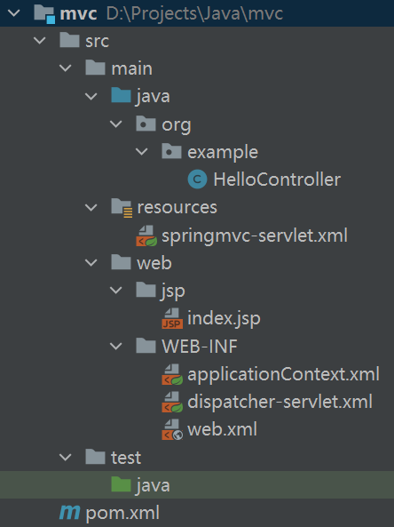
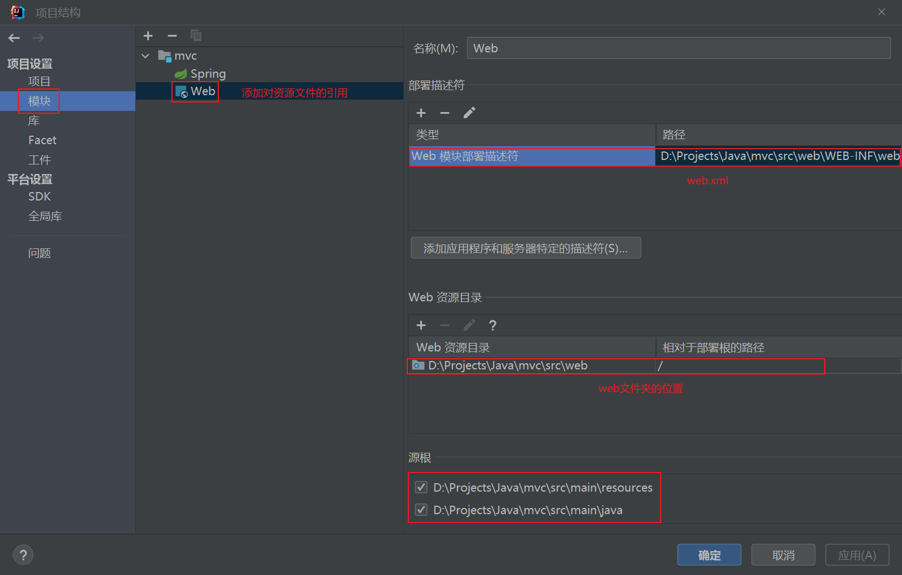
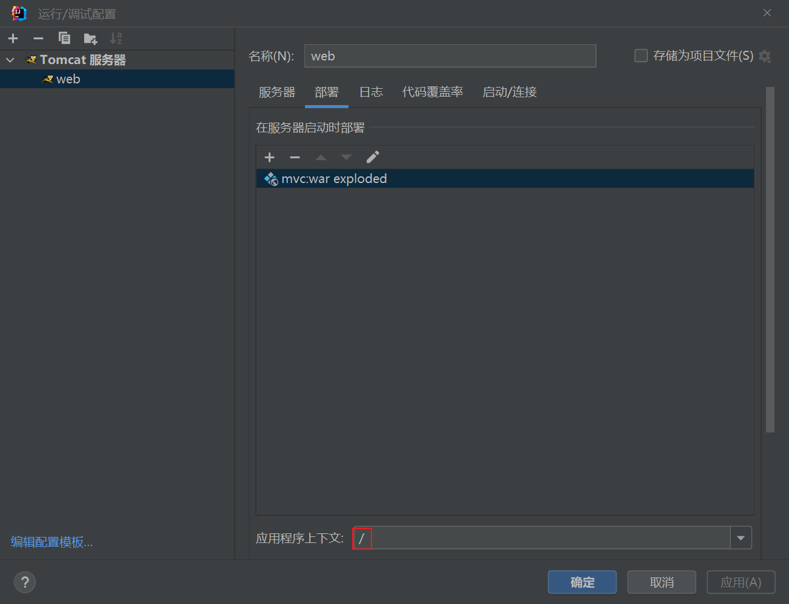

# 第一个Spring MVC程序

SpringMVC的开发步骤：

1.  创建项目
2.  导入SpringMVC依赖
3.  配置SpringMVC核心控制器DispathcerServlet
4.  创建Controller类和视图页面
5.  使用注解配置Controller类中业务方法的映射地址
6.  配置SpringMVC核心文件 spring-mvc.xml
7.  配置Tomcat
8.  测试效果

## 创建 Maven 工程

目录结构：



## 配置 pom.xml

添加SpringMVC依赖：

```
<dependencies>
    <dependency>
        <groupId>org.springframework</groupId>
        <artifactId>spring-webmvc</artifactId>
        <version>5.3.20</version>
    </dependency>
</dependencies>
```

## 配置spring

springmvc-servlet.xml：

```
<?xml version="1.0" encoding="UTF-8"?>
<beans xmlns="http://www.springframework.org/schema/beans"
       xmlns:xsi="http://www.w3.org/2001/XMLSchema-instance"
       xmlns:context="http://www.springframework.org/schema/context"
       xsi:schemaLocation="http://www.springframework.org/schema/beans http://www.springframework.org/schema/beans/spring-beans.xsd http://www.springframework.org/schema/context https://www.springframework.org/schema/context/spring-context.xsd">

    <context:component-scan base-package="org.example"/>

    <bean class="org.springframework.web.servlet.handler.BeanNameUrlHandlerMapping"/>
    <bean class="org.springframework.web.servlet.mvc.SimpleControllerHandlerAdapter"/>

    <!--视图解析器-->
    <bean class="org.springframework.web.servlet.view.InternalResourceViewResolver" id="internalResourceViewResolver">
        <!--前缀-->
        <property name="prefix" value="/jsp/"/>
        <!--后缀-->
        <property name="suffix" value=".jsp"/>
    </bean>

    <bean id="/index" class="org.example.IndexController"/>
</beans>
```

## 配置Servlet

在开发 Spring MVC 应用时需要在 web.xml 中部署 DispatcherServlet，代码如下：

```
<?xml version="1.0" encoding="UTF-8"?>
<web-app xmlns="http://xmlns.jcp.org/xml/ns/javaee"
         xmlns:xsi="http://www.w3.org/2001/XMLSchema-instance"
         xsi:schemaLocation="http://xmlns.jcp.org/xml/ns/javaee http://xmlns.jcp.org/xml/ns/javaee/web-app_4_0.xsd"
         version="4.0">
<!--    <context-param>-->
<!--        <param-name>contextConfigLocation</param-name>-->
<!--        <param-value>/WEB-INF/applicationContext.xml</param-value>-->
<!--    </context-param>-->
<!--    <listener>-->
<!--        <listener-class>org.springframework.web.context.ContextLoaderListener</listener-class>-->
<!--    </listener>-->
    <!--1.注册DispatcherServlet-->
    <servlet>
        <servlet-name>springmvc</servlet-name>
        <servlet-class>org.springframework.web.servlet.DispatcherServlet</servlet-class>
        <!--关联一个springmvc的配置文件:【servlet-name】-servlet.xml-->
        <init-param>
            <param-name>contextConfigLocation</param-name>
            <param-value>classpath:springmvc-servlet.xml</param-value>
        </init-param>
        <!--启动级别-1-->
        <!--
        <load-on-startup>1</load-on-startup>的作用
        1)load-on-startup元素标记容器是否在启动的时候就加载这个servlet(实例化并调用其init()方法)。
        2)它的值必须是一个整数，表示servlet应该被载入的顺序
        3)当值为0或者大于0时，表示容器在应用启动时就加载并初始化这个servlet；
        4)当值小于0或者没有指定时，则表示容器在该servlet被选择时才会去加载。
        5)正数的值越小，该servlet的优先级越高，应用启动时就越先加载。
        6)当值相同时，容器就会自己选择顺序来加载。
        -->
        <load-on-startup>1</load-on-startup>
    </servlet>
    <!--/ 匹配所有的请求；（不包括.jsp）-->
    <!--/* 匹配所有的请求；（包括.jsp）-->

    <servlet-mapping>
        <servlet-name>springmvc</servlet-name>
        <url-pattern>/</url-pattern>
    </servlet-mapping>
    
    <!--    乱码问题通过过滤器解决 , 而SpringMVC给我们提供了一个过滤器-->
    <filter>
        <filter-name>encoding</filter-name>
        <filter-class>org.springframework.web.filter.CharacterEncodingFilter</filter-class>
        <init-param>
            <param-name>encoding</param-name>
            <param-value>utf-8</param-value>
        </init-param>
    </filter>
    <filter-mapping>
        <filter-name>encoding</filter-name>
        <url-pattern>/*</url-pattern>
    </filter-mapping>
</web-app>
```

> 注：`<url-pattern>`标签中使用`/`和`/*`的区别：
>
> `/`所匹配的请求可以是`/login`或`.html`或`.js`或`.css`方式的请求路径，但是`/`不能匹配`.jsp`请求路径的请求
>
> 因此就可以避免在访问`.jsp`页面时，该请求被 DispatcherServlet 处理，从而找不到相应的页面的情况
>
> `/*`则能够匹配所有请求，例如在使用过滤器时，若需要对所有请求进行过滤，就需要使用`/*`的写法

Spring MVC 初始化时将在应用程序的 WEB-INF 目录下查找配置文件，该配置文件的命名规则是“servletName-servlet.xml”，例如 springmvc-servlet.xml。

也可以将 Spring MVC 的配置文件存放在应用程序目录中的任何地方，但需要使用 servlet 的 init-param 元素加载配置文件，通过 contextConfigLocation 参数来指定 Spring MVC 配置文件的位置，示例代码如下。

```
<init-param>
    <param-name>contextConfigLocation</param-name>
    <param-value>classpath:springmvc-servlet.xml</param-value>
</init-param>
```

此处使用 Spring 资源路径的方式进行指定，即 `classpath:springmvc-servlet.xml`。

上述代码配置了一个名为“springmvc”的 Servlet。该 Servlet 是 DispatcherServlet 类型，它就是 Spring MVC 的入口，并通过 `<load-on-startup>1</load-on-startup> `配置标记容器在启动时就加载此 DispatcherServlet，即自动启动。然后通过 servlet-mapping 映射到“/”，即 DispatcherServlet 需要截获并处理该项目的所有 URL 请求。

## 添加页面

创建首页`index.jsp`

```html
<%@ page contentType="text/html;charset=UTF-8" language="java" %>
<html>
<head>
    <title>Title</title>
</head>
<body>
<h1>Index page</h1>
${msg}
</body>
</html>
```

## 创建Controller

```java
import org.springframework.web.servlet.ModelAndView;
import org.springframework.web.servlet.mvc.Controller;

import javax.servlet.http.HttpServletRequest;
import javax.servlet.http.HttpServletResponse;

public class IndexController implements Controller {
    @Override
    public ModelAndView handleRequest(HttpServletRequest request, HttpServletResponse response) {
        // 创建ModelAndView对象
        ModelAndView mav = new ModelAndView();
        // 向模型对象中添加数据
        mav.addObject("msg", "Hello,SpringMVC");
        // 设置逻辑视图名。
        //该处路径属于静态路径写法。
        //也可以写逻辑路径。
        mav.setViewName("/index");
        // 返回ModelAndView对象
        return mav;
    }
}
```

如果IDEA报`mav.setViewName("/index");`找不到`/index`的错误，需要重新设置web目录：



## 配置Tomcat

Tomcat10下载地址：https://tomcat.apache.org/download-10.cgi



运行Tomcat即可访问/index
