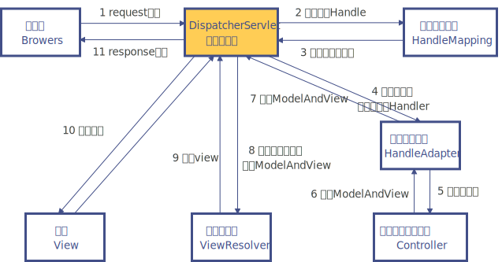

# Spring MVC执行流程

Spring MVC 是基于 Servlet 的，DispatcherServlet 是整个 Spring MVC 框架的核心，主要负责截获请求并将其分派给相应的处理器处理。

1.  浏览器向服务端提交请求，请求会被核心控制器DispatcherServlet拦截。
2.  DispatcherServlet收到请求后，调用HandlerMapping查找 Handler（ 可以根据xml配置、注解进行查找）
3.  HandlerMapping根据请求url找到具体的处理器Handler，生成处理器对象及处理器拦截器(如果有则生成)，一并返回给DispatcherServlet；
4.  核心控制器根据处理器执行链中的处理器，找到能够执行该处理器的处理器适配器HandlerAdapter。
5.  处理器适配器HandlerAdapter调用执行处理器Controller去执行Handler。
6.  处理器Controller将处理结果及要跳转的视图封装到一个对象ModelAndView中，并将其返回给处理器适配器HandlerAdapter。
7.  处理器适配器向核心控制器返回ModelAndView（ModelAndView是springmvc框架的一个底层对象，包括Model和view）
8.  DispatcherServlet请求ViewResolver去进行视图解析（根据逻辑视图名解析成真正的视图(jsp)）
9.  ViewResolver向核心控制器返回View
10.  DispatcherServlet调用视图对象View，进行视图渲染（ 视图渲染将模型数据(在ModelAndView对象中)填充到request域），生成响应对象。
11.  核心控制器向用户响应结果

Spring MVC的运行原理和流程如图所示。

