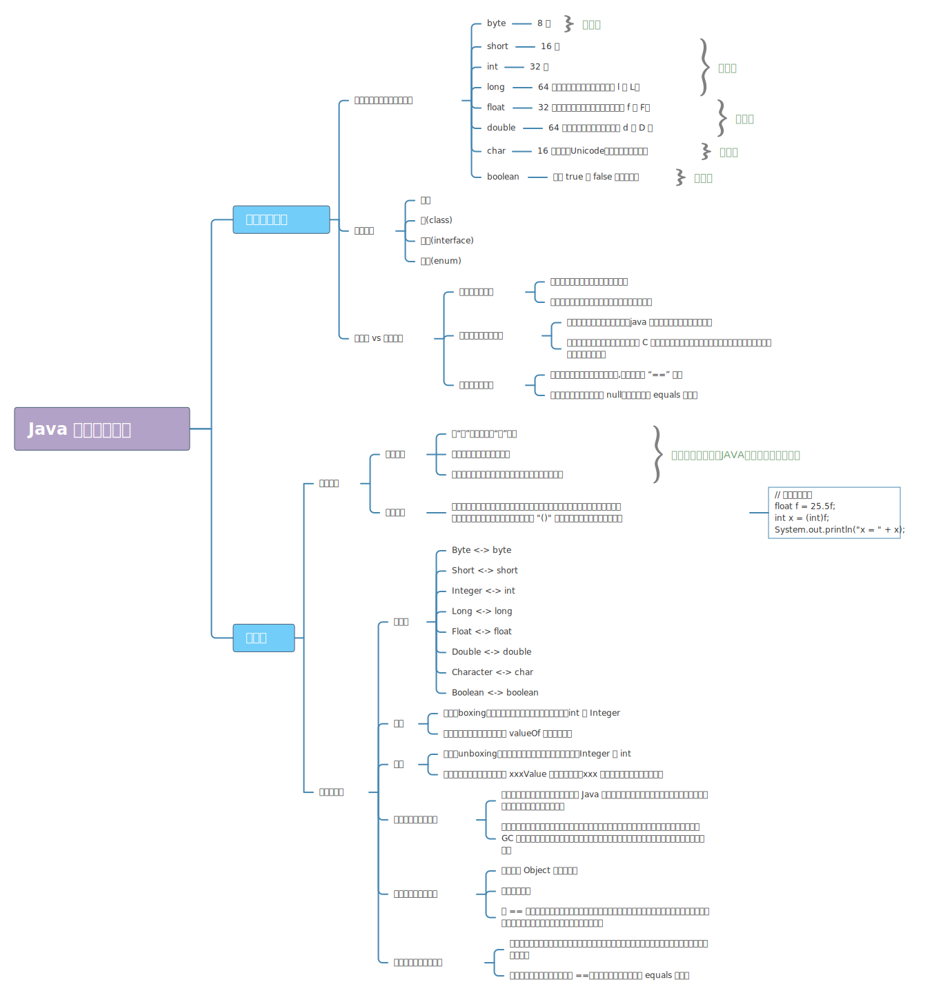

# 简介

Java语言提供了八种基本类型。六种数字类型（四个整数型，两个浮点型），一种字符类型，还有一种布尔型。

| 基本数据类型 | 分类   | 比特数 | 字节 | 默认值     | 取值范围                      | 说明                              |
| ------------ | ------ | ------ | ---- | ---------- | ----------------------------- | --------------------------------- |
| `byte`       | 整数型 | 8 位   | 1    | `0`        | [-$2^7$, $2^7 - 1$]           |                                   |
| `short`      | 整数型 | 16 位  | 2    | `0`        | [-$2^{15}$, $2^{15} - 1$]     |                                   |
| `int`        | 整数型 | 32 位  | 4    | `0`        | [-$2^{31}$, $2^{31} - 1$]     |                                   |
| `long`       | 整数型 | 64 位  | 8    | `0L`       | [-$2^{63}$, $2^{63} - 1$]     | 赋值时一般在数字后加上 `l` 或 `L` |
| `float`      | 浮点型 | 32 位  | 4    | `+0.0F`    | [$2^{-149}$, $2^{128} - 1$]   | 赋值时必须在数字后加上 `f` 或 `F` |
| `double`     | 浮点型 | 64 位  | 8    | `+0.0D`    | [$2^{-1074}$, $2^{1024} - 1$] | 赋值时一般在数字后加 `d` 或 `D`   |
| `char`       | 字符型 | 16 位  | 2    | `'\u0000'` | [0, $2^{16} - 1$]             | 存储 Unicode 码，用单引号赋值     |
| `boolean`    | 布尔型 | 8 位   | 1    | `false`    | {false, true}                 |                                   |

Java中的数据类型有两类：

- 值类型（又叫内置数据类型，基本数据类型）
- 引用类型（除值类型以外，都是引用类型，包括 `String`、类、接口、数组和枚举。）

基本数据类型分为四类（共8种）：

-   整数类型：byte、short、int、long
-   浮点数型：float、double
-   字符型：char
-   布尔型：boolean

在这些基本类型中，`boolean` 和 `char` 是唯二的无符号类型。
