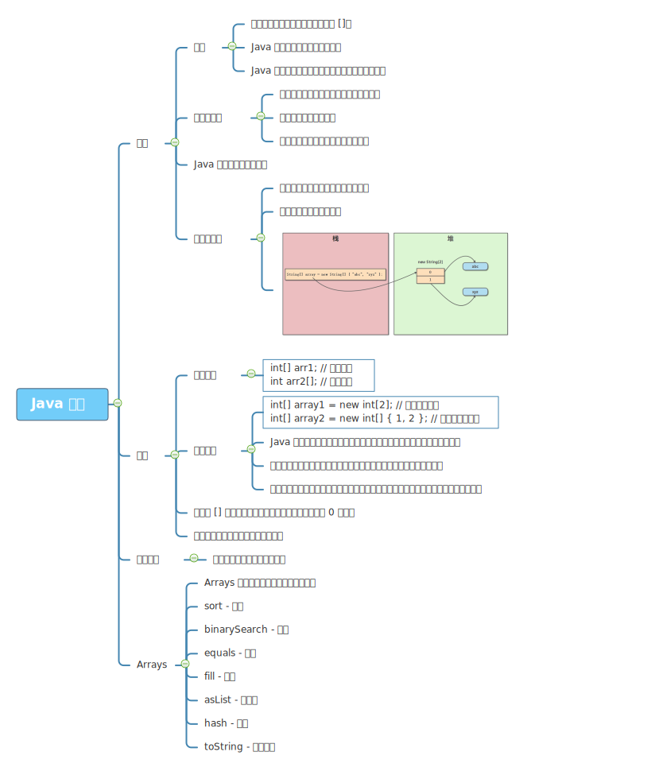
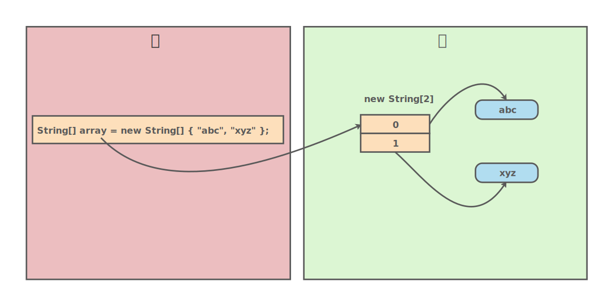

# 数组



Java 中，数组是一种引用类型，用来存储固定大小的同类型元素。

数组的定义和使用需要通过方括号 `[]`。

## Java 数组的本质

Java 数组的本质是对象。它具有 Java 中其他对象的一些基本特点：封装了一些数据，可以访问属性，也可以调用方法。所以，数组是对象。

如果有两个类 A 和 B，如果 B 继承（extends）了 A，那么 A[] 类型的引用就可以指向 B[] 类型的对象。

## Java 数组和内存

Java 数组在内存中的存储是这样的：

- 数组对象（这里可以看成一个指针）存储在栈中。

- 数组元素存储在堆中。


如下图所示：只有当 JVM 执行 `new String[]` 时，才会在堆中开辟相应的内存区域。数组对象 array 可以视为一个指针，指向这块内存的存储地址。



## 声明数组

声明数组变量的语法如下：

```java
int[] arr1; // 推荐风格
int arr2[]; // 效果相同
```

## 创建数组

Java 使用 `new` 操作符来创建数组。有两种创建数组方式：

- 指定数组维度
  - 为数组开辟指定大小的数组维度。
  - 如果数组元素是基础数据类型，会将每个元素设为默认值；如果是引用类型，元素值为 `null`。
- 不指定数组维度
  - 用花括号中的实际元素初始化数组，数组大小与元素数相同。

示例 1：

```java
public class ArrayDemo {
    public static void main(String[] args) {
        int[] array1 = new int[2]; // 指定数组维度
        int[] array2 = new int[] { 1, 2 }; // 不指定数组维度

        System.out.println("array1 size is " + array1.length);
        for (int item : array1) {
            System.out.println(item);
        }

        System.out.println("array2 size is " + array1.length);
        for (int item : array2) {
            System.out.println(item);
        }
    }
}
// Output:
// array1 size is 2
// 0
// 0
// array2 size is 2
// 1
// 2
```

数组 array1 中的元素虽然没有初始化，但是 length 和指定的数组维度是一样的。这表明指定数组维度后，无论后面是否初始化数组中的元素，数组都已经开辟了相应的内存。

数组 array1 中的元素都被设为默认值。

示例 2：

```java
public class ArrayDemo2
{
    static class User
    {
    }

    public static void main(String[] args)
    {
        User[] array1 = new User[2]; // 指定数组维度
        User[] array2 = new User[] {new User(), new User()}; // 不指定数组维度

        System.out.println("array1: ");
        for (User item : array1)
        {
            System.out.println(item);
        }

        System.out.println("array2: ");
        for (User item : array2)
        {
            System.out.println(item);
        }
    }
}
// array1: 
// null
// null
// array2: 
// org.example.ArrayDemo2$User@7c30a502
// org.example.ArrayDemo2$User@49e4cb85
```

### 数组维度的形式

创建数组时，指定的数组维度可以有多种形式：

- 数组维度可以是整数、字符。
- 数组维度可以是整数型、字符型变量。
- 数组维度可以是计算结果为整数或字符的表达式。

示例：

```java
public class ArrayDemo3
{
    public static void main(String[] args)
    {
        int length = 3;
        // 放开被注掉的代码，编译器会报错
        // int[] array = new int[4.0];
        // int[] array2 = new int["test"];
        int[] array3 = new int['a'];
        int[] array4 = new int[length];
        int[] array5 = new int[length + 2];
        int[] array6 = new int['a' + 2];
        // int[] array7 = new int[length + 2.1];
        System.out.println("array3.length = [" + array3.length + "]");
        System.out.println("array4.length = [" + array4.length + "]");
        System.out.println("array5.length = [" + array5.length + "]");
        System.out.println("array6.length = [" + array6.length + "]");
    }
}
// Output:
// array3.length = [97]
// array4.length = [3]
// array5.length = [5]
// array6.length = [99]
```

当指定的数组维度是字符时，Java 会将其转为整数。如字符 `a` 的 ASCII 码是 97。

综上，Java 数组的数组维度可以是常量、变量、表达式，只要转换为整数即可。

### 数组维度的大小

数组维度并非没有上限的，如果数值过大，编译时会报错。

```java
int[] array = new int[6553612431]; // 数组维度过大，编译报错
```

此外，数组过大，可能会导致栈溢出。

## 访问数组

Java 中，可以通过在 `[]` 中指定下标，访问数组元素，下标位置从 0 开始。

```java
public class ArrayDemo4 {
    public static void main(String[] args) {
        int[] array = {1, 2, 3};
        for (int i = 0; i < array.length; i++) {
            array[i]++;
            System.out.println(String.format("array[%d] = %d", i, array[i]));
        }
    }
}
// Output:
// array[0] = 2
// array[1] = 3
// array[2] = 4
```

上面的示例中，从 0 开始，使用下标遍历数组 array 的所有元素，为每个元素值加 1 。

## 数组的引用

Java 中，数组类型是一种引用类型。因此，它可以作为引用，被 Java 函数作为函数入参或返回值。

数组作为函数入参的示例：

```java
public class ArrayRefDemo {
    private static void fun(int[] array) {
        for (int i : array) {
            System.out.print(i + "\t");
        }
    }

    public static void main(String[] args) {
        int[] array = new int[] {1, 3, 5};
        fun(array);
    }
}
// Output:
// 1	3	5
```

数组作为函数返回值的示例：

```java
public class ArrayRefDemo2 {
    /**
     * 返回一个数组
     */
    private static int[] fun() {
        return new int[] {1, 3, 5};
    }

    public static void main(String[] args) {
        int[] array = fun();
        System.out.println(Arrays.toString(array));
    }
}
// Output:
// [1, 3, 5]
```

## 泛型数组

通常，数组和泛型不能很好地结合。你不能实例化具有参数化类型的数组。

```java
Peel<Banana>[] peels = new Pell<Banana>[10]; // 这行代码非法
```

Java 中不允许直接创建泛型数组。但是，可以通过创建一个类型擦除的数组，然后转型的方式来创建泛型数组。

```java
import java.util.Arrays;

public class GenericArrayDemo<T>
{

    static class GenericArray<T>
    {
        private T[] array;

        public GenericArray(int num)
        {
            array = (T[]) new Object[num];
        }

        public void put(int index, T item)
        {
            array[index] = item;
        }

        public T get(int index)
        {
            return array[index];
        }

        public T[] array()
        {
            return array;
        }
    }

    public static void main(String[] args)
    {
        GenericArray<Integer> genericArray = new GenericArray<Integer>(4);
        genericArray.put(0, 0);
        genericArray.put(1, 1);
        Object[] array = genericArray.array();
        System.out.println(Arrays.deepToString(array));
    }
}
// Output:
// [0, 1, null, null]
```

> 扩展阅读：https://www.cnblogs.com/jiangzhaowei/p/7399522.html
>
> 对于泛型数组的理解，点到为止即可。实际上，真的需要存储泛型，还是使用容器更合适。

## 多维数组

多维数组可以看成是数组的数组，比如二维数组就是一个特殊的一维数组，其每一个元素都是一个一维数组。

多维数组使用示例：

```java
import java.util.Arrays;

public class MultiArrayDemo
{
    public static void main(String[] args)
    {
        Integer[][] a1 = { // 自动装箱
            {1, 2, 3,},
            {4, 5, 6,},
        };
        Double[][][] a2 = { // 自动装箱
            {{1.1, 2.2}, {3.3, 4.4}}, 
            {{5.5, 6.6}, {7.7, 8.8}},
            {{9.9, 1.2}, {2.3, 3.4}},
        };
        String[][] a3 = {
            {"The", "Quick", "Sly", "Fox"},
            {"Jumped", "Over"},
            {"The", "Lazy", "Brown", "Dog", "and", "friend"},
        };
        System.out.println("a1: " + Arrays.deepToString(a1));
        System.out.println("a2: " + Arrays.deepToString(a2));
        System.out.println("a3: " + Arrays.deepToString(a3));
    }
}
// Output:
// a1: [[1, 2, 3], [4, 5, 6]]
// a2: [[[1.1, 2.2], [3.3, 4.4]], [[5.5, 6.6], [7.7, 8.8]], [[9.9, 1.2], [2.3, 3.4]]]
// a3: [[The, Quick, Sly, Fox], [Jumped, Over], [The, Lazy, Brown, Dog, and, friend]]
```

## Arrays 类

Java 中，提供了一个很有用的数组工具类：Arrays。

它提供的主要操作有：

- `sort` ：排序
- `binarySearch`：查找
- `equals` ：比较
- `fill` ：填充
- `asList`：转列表
- `hash` ：哈希
- `toString` ：转字符串
