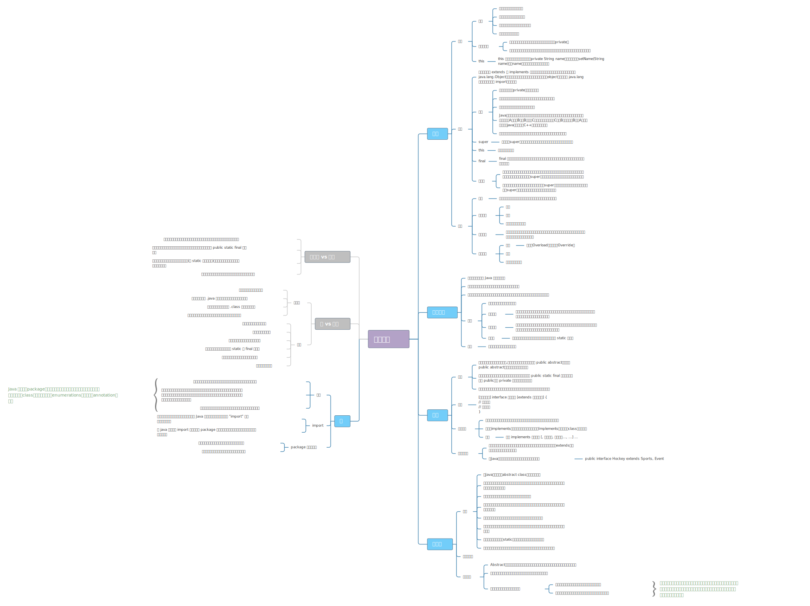

# 简介



简单来说，面向对象编程（Object Oriented Programming，OOP）就是描述对象与对象之间的相互作用。

在Java中，一切皆为对象。

在Java中，对象的状态就是变量，对象的行为就是方法（或者称为函数）。

类（Class）是对象（Object）的模板，对象是类的实例（Instance）。

- 首先，所有 Java 类都继承自 `Object` 类。
- 几乎所有 Java 对象初始化时，都要使用 `new` 创建对象（基本数据类型、String、枚举特殊处理），对象存储在堆中。

```java
String s = "abc";
String s = new String("abc");
```

其中，`String s` 定义了一个名为 s 的引用，它指向一个 `String` 类型的对象，而实际的对象是 `“abc”` 字符串。

