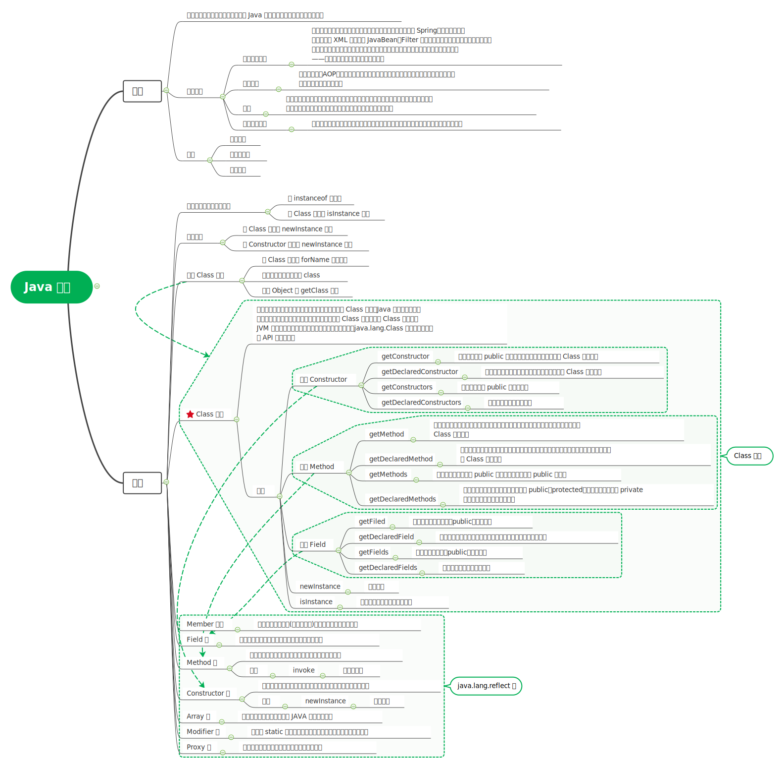
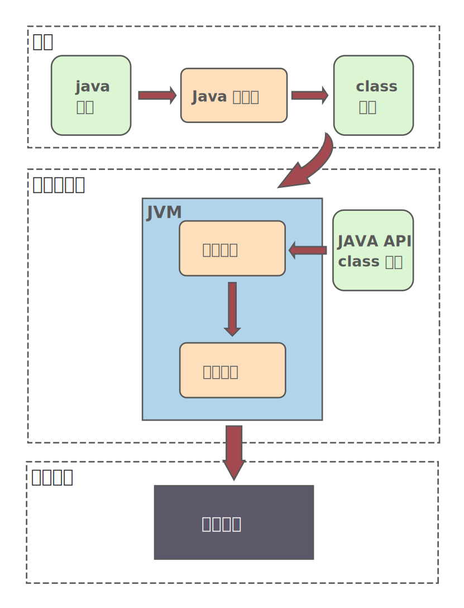

# 反射



## 简介

对于任意一个类，在运行状态时，都能获取这个类的**所有属性和方法**，并且能调用它的任意方法，这种动态获取信息以及动态调用对象方法的功能称为java语言的反射机制。

**通过反射机制，可以在运行时访问 Java 对象的属性，方法，构造方法等。**

功能：

1. 运行时判断任意一个对象的所有属性。
2. 在运行时构造任意一个类的对象。
3. 在运行时判断任意一个类所有的成员变量和方法。
4. 在运行时调用任意一个对象的方法。
5. 生成动态代理。

**易错点:**

问题1：下列有关反射的说法错误的是：B


- [ ] A. 反射可以获取`Method`，通过`invoke()`进行方法的调用

- [x] B. 反射可以获取注解（@Target为Runtime）信息

- [ ] C. 反射能够直接通过get(obj)获取私有Field成员的值

- [ ] D. 反射可以获取类的构造器

> 答：注解@Target没有Runtime，@Retention才有Runtime。反射可以获取注解信息，通过调用`class`对象的`getDeclaredAnnotations()`方法。

问题2：Java反射机制的作用包括: A、B、C、D

- [x] A. 在运行时判断任意一个对象所属的类。

- [x] B. 在运行时构造任意一个类的对象。

- [x] C. 在运行时判断任意一个类所具有的成员变量和方法。

- [x] D. 在运行时调用任意一个对象的方法。

反射的主要应用场景有：

- **开发通用框架**：反射最重要的用途就是开发各种通用框架。很多框架（比如 Spring）都是配置化的（比如通过 XML 文件配置 JavaBean、Filter 等），为了保证框架的通用性，它们可能需要根据配置文件加载不同的对象或类，调用不同的方法，这个时候就必须用到反射——运行时动态加载需要加载的对象。
- **动态代理**：在切面编程（AOP）中，需要拦截特定的方法，通常，会选择动态代理方式。这时，就需要反射技术来实现了。
- **注解**：注解本身仅仅是起到标记作用，它需要利用反射机制，根据注解标记去调用注解解释器，执行行为。如果没有反射机制，注解并不比注释更有用。
- **可扩展性功能**：应用程序可以通过使用完全限定名称创建可扩展性对象实例来使用外部的用户定义类。

反射的缺点：

- **性能开销**：由于反射涉及动态解析的类型，因此无法执行某些 Java 虚拟机优化。因此，反射操作的性能要比非反射操作的性能要差，应该在性能敏感的应用程序中频繁调用的代码段中避免。
- **破坏封装性**：反射调用方法时可以忽略权限检查，因此可能会破坏封装性而导致安全问题。
- **内部曝光**：由于反射允许代码执行在非反射代码中非法的操作，例如访问私有字段和方法，所以反射的使用可能会导致意想不到的副作用，这可能会导致代码功能失常并可能破坏可移植性。反射代码打破了抽象，因此可能会随着平台的升级而改变行为。

## 反射的使用

反射流程：

1. 获取类的`Class`对象实例
2. 根据`Class`对象的实例获取`Constructor`对象
3. 使用`Constructor`对象的`newInstance`方法获取反射类的对象
4. 获取其他方法、属性，调用方法等操作

实例如下：

1、创建一个Student的类

```java
public class Student {
    private String name;
    private int age;
 
    public Student() {}
    public Student()(String name, int i) {
        this.name = name;
        this.age = age;
    }
 
    public String getName() {
        return name;
    }
 
    public void setName(String name) {
        this.name = name;
    }
 
    public int getAge() {
        return age;
    }
 
    public void setAge(int age) {
        this.age = age;
    }
 
    @Override
    public String toString() {
        return "Student{" +
                "name='" + name + '\'' +
                ", age=" + age +
                '}';
    }
}
```

2、`Student`的反射类`ReflectStuent`，创建一个student类，并设置对应的属性！

```java
// 创建一个对象    
public void reflectNewInstance() {
	try {
		Class<?> classStudent = Class.forName("org.example.Student");
		Student student = (Student) classStudent.newInstance();
        student.setAge(16);
        student.setName("Jack");
    } catch (ClassNotFoundException | InstantiationException | IllegalAccessException e) {
        e.printStackTrace();
    }
}
```

注意：

- 如果`Student`类没有无参构造函数将报`java.lang.InstantiationException`, 主要原因是`Class`对象创建实例，通过构造器创建，`newInstance()`底层调用无参数构造器`newInstance()`
- 调用`forName`获取类，如果`Student`有静态方法或者静态代码，会打印出来！

## 详解

### 获取反射中的`Class`对象

在API中，获取`Class`对象有三种方法

1.   使用Class.forName静态方法：当知道该类的全路径名时，可以使用该方法获取Class类对象。

```
Class clz = Class.forName("org.example.Student");
```

2.    使用`类.class`方法：这种方法只适合在编译前就知道操作的Class。

```
Class clz = Student.class;
```

3.    使用类对象的getClass()方法。

```
String str = new String("Student");
Class stu = str.getClass();
```

以`Student`类为例，讲解三种方式的差异：

```java
public class Student {
    public static String name = getStudentName();

    static {
        System.out.println("Student的静态代码块");
    }

    {
        System.out.println("Student的普通代码块");
    }

    public Student() {
        System.out.println("Student: 构造方法");
    }

    public static String getStudentName() {
        System.out.println("Student：静态方法");
        return "Jack";
    }
}
```

构建场景进行测试：

```java
import org.testng.annotations.Test;

public class ReflectStudent {
    @Test
    public void test1() {
        Class<?> clz = Student.class;
    }

    @Test
    public void test2() throws ClassNotFoundException {
        Class<?> clz = Class.forName("org.example.Student");
    }

    @Test
    public void test3() {
        Class<?> clz = new Student().getClass();
    }
}
```

以上打印的结果如下：

`test1`没有任何输出；

`test2`输出如下：

```html
Student：静态方法
Student的静态代码块
```

`test3`输出如下：

```html
Student：静态方法
Student的静态代码块
Student的普通代码块
Student: 构造方法
```

`Student.class`方法获取对象的`Class`对象，不会调用对象中任何代码，

`Class.forName()`会调用静态代码块的内容

`getClass()`因为要实例化，所以会全部打印！

- 场景一：

```java
public void test4() throws ClassNotFoundException {
    Class<?> clz = Student.class;
    System.out.println("-----------");
    clz = Class.forName("org.example.Student");
    System.out.println("-----------");
    clz = new Student().getClass();
}
```

打印结果：

```html
-----------
Student：静态方法
Student的静态代码块
-----------
Student的普通代码块
Student: 构造方法
```

注意`Class.forName()`方法执行静态代码之后，`new Student().getClass()`不会执行同样的静态代码块。

- 场景二：

```java
@Test
public void test5() throws ClassNotFoundException {
    Class<?> clz1 = Student.class;
    Class<?> clz2 = Class.forName("org.example.Student");
    Class<?> clz3 = new Student().getClass();
    System.out.println(clz1 == clz2);
    System.out.println(clz2 == clz3);
}
```

打印结果：

```html
Student：静态方法
Student的静态代码块
Student的普通代码块
Student: 构造方法
true
true
```

类加载阶段是将`Class`文件中的二进制数据读取到内存中，并在堆内存中生成一个该类的`java.lang.class`对象，不管某个类被加载多少次，对应堆内存中的`class`对象始终只有一个。

总结：

- 类名.class: JVM使用类加载器，将类加载在内存中，不做类的初始化，返回`Class`的对象。
- Class.forName(“类名字符串”): 装入类，并做类的静态初始化，返回`Class`的对象。
- 实例对象.getClass(): 对类进行静态初始化、非静态初始化；返回引用时执行的对象所属的类的`Class`的对象。

### 通过反射创建对象

通过反射创建类对象有两种方式：通过`Class`对象的`newInstance()`方法，通过`Constructor`的对象`newInstance()`方法。

1. 通过`Class`对象的`newInstance()`

```java
@Test
public void test6() throws IllegalAccessException, InstantiationException {
    Class clz = Student.class;
    Student student = (Student)clz.newInstance();
}
```

1. 通过`Constructor`对象`newInstance`方法

```java
@Test
public void test7() throws IllegalAccessException, InstantiationException, NoSuchMethodException, InvocationTargetException {
    Class clz = Student.class;
    Constructor constructor = clz.getConstructor();
    Student student = (Student)constructor.newInstance();
}
```

通过`Constructor`对象创建对象可以选择特定的构造方法，而通过`Class`对象构造的只能使用默认的无参构造方法。

```java
@Test
public void test8() throws IllegalAccessException, InstantiationException, NoSuchMethodException, InvocationTargetException {
    Class clz = Student.class;
    Constructor constructor = clz.getConstructor(String.class, int.class);
    Student student = (Student)constructor.newInstance("Jack", 18);
}
```

### 通过反射获取类属性、方法、构造器

#### 反射API

- `Field`类：提供相关的属性信息，已经对它的访问权限。
- `Constructor`：提供类的构造方法信息，以及它的动态访问权限。
- `Method`：提供类的方法信息。
- `Class`：表示正在运行类的实例。

#### 获取成员变量getFields和getDeclaredFields

```java
@Test
public void test9() {
    Class clz = Student.class;
    // 获取共有字段
    Field[] fields = clz.getFields();
    for (Field field : fields) {
        System.out.println(field.getName());
    }
    System.out.println("---------------------");
    Field[] allFields = clz.getDeclaredFields();
    for (Field field : allFields) {
        System.out.println(field.getName());
    }
}
```

输出结果：

```html
name1
---------------------
name
age
name1
```

`getFields`获取公有字段; `getDeclaredFields`获取公有字段和私有字段。

**注意：**在继承的场景下，调用`getFields()`方法，输出子类既父类的所有的`public`方法，而`getDeclaredFields`仅仅输出子类的所有成员变量。如下：

```java
class Father {
    public String fatherName;
    public int fatherAge;
}
 
class Son extends Father {
    public String sonName;
    public int sonAge;
    protected int sonHigh;
 
    public static void main(String[] args) {
        Field[] fields = Son.class.getFields();
        Field[] declaredFileds = Son.class.getDeclaredFields();
 
        for (Field field : fields) {
            System.out.println(field.getName());
        }
 
        System.out.println("-------------------");
        for (Field field : declaredFileds) {
            System.out.println(field.getName());
        }
    }
}
```

输出结果如下:

```html
sonName
sonAge
fatherName
fatherAge
-------------------
sonName
sonAge
sonHigh
```

**易错点**

问题1: 以下代码输出：B

```java
class Parent {
    public int a = 100;
    private int b = 200;
    protected int c =300;
    public int f() {
        return 10;
    }
    public static void main(String[] args) throws IllegalAccessException, InstantiationException {
        Field[] fields = Parent.class.getDeclaredFields();
        System.out.println(fields.length);
 
        Field[] fields1 = Parent.class.getFields();
        System.out.println(fields1.length);
    }
}
```

- [ ] A. 1 3

- [x] B. 3 1

- [ ] C. 1 1

- [ ] D. 3 3

#### 获取构造方法getConstructors和getDeclaredConstructors

```java
    @Test
    public void test10() {
        Class<?> clz = Student.class;
        Constructor[] declaredConstructors = clz.getDeclaredConstructors();
        for (Constructor constructor : declaredConstructors) {
            System.out.println(constructor);
        }
        System.out.println("-------------");
        Constructor[] constructors = clz.getConstructors();
        for (Constructor constructor : constructors) {
            System.out.println(constructor);
        }
    }
```

输出结果：

```html
private org.example.Student(java.lang.String)
public org.example.Student(java.lang.String,int)
public org.example.Student()
-------------
public org.example.Student(java.lang.String,int)
public org.example.Student()
```

> `getDeclaredConstructors`获取类的公有和私有的构造器；`getConstructors`: 获取公有的构造器。

#### 获取其他方法

```java
@Test
public void test11() {
    Class<?> clz = Student.class;
    Method[] declaredMethods = clz.getDeclaredMethods();
    for (Method method : declaredMethods) {
        System.out.println(method);
    }
    System.out.println("-------------");
    Method[] methods = clz.getMethods();
    for (Method method : methods) {
        System.out.println(method);
    }
}
```

输出结果：

```html
public static java.lang.String org.example.Student.getStudentName()
-------------
public static java.lang.String org.example.Student.getStudentName()
public final void java.lang.Object.wait(long,int) throws java.lang.InterruptedException
public final native void java.lang.Object.wait(long) throws java.lang.InterruptedException
public final void java.lang.Object.wait() throws java.lang.InterruptedException
public boolean java.lang.Object.equals(java.lang.Object)
public java.lang.String java.lang.Object.toString()
public native int java.lang.Object.hashCode()
public final native java.lang.Class java.lang.Object.getClass()
public final native void java.lang.Object.notify()
public final native void java.lang.Object.notifyAll()
```

> `getDeclaredMethods`获取本类的公共方法和私有方法；`getMethods`: 获取公有的方法，包括`Object`类的方法（包括从父类继承的）。

易错点:

问题1：下面哪个不是Class类中定义的反射方法: B

- [ ] A. `getDeclaredFields`

- [x] B. `getDeclaredNames`

- [ ] C. `getDeclaredMethods`

- [ ] D. `getDeclaredConstructors`

> 答: 无getDeclaredNames

#### 其他相关信息

1. 获取类名

```java
Class clz = Student.class;
System.out.println(clz.getName());
System.out.println(clz.getSimpleName());

```

输出：

```html
org.example.Student
Student
```

其中`getName()`获取类名包含包信息，`getSimpleName()`获取类名，不包含包信息。

1. 修饰符

```java
Class clz = Student.class;
System.out.println(clz.getModifiers());
```

输出：

```html
1
```

类的修饰符有`public`，`private`等类型，`getModifiers()`可以获取一个类的修饰符，返回信息时int。

1. 包信息

```java
Class clz = Student.class;
System.out.println(clz.getPackage());
```

输出：

```html
package org.example
```

1. 返回类型和参数

```java
public void test16() throws ClassNotFoundException, NoSuchMethodException {
	// 获取Class对象
    Class clz = Class.forName("org.example.Student");
    Method[] methods = clz.getDeclaredMethods();
    for (Method method : methods) {
        // 获取方法的返回类型
        Class<?> returnType = method.getReturnType();
        System.out.println("方法的名称:" + method.getName() + ", 返回的类型：" + returnType);
        // 获取方法的返回类型
        Parameter[] parameters = method.getParameters();
        for (Parameter parameter : parameters) {
            System.out.println(parameter);
        }
    }
}
```

## 反射机制

### 类加载过程



类加载的完整过程如下：

1. 在编译时，Java 编译器编译好 `.java` 文件之后，在磁盘中产生 `.class` 文件。`.class` 文件是二进制文件，内容是只有 JVM 能够识别的机器码。
2. JVM 中的类加载器读取字节码文件，取出二进制数据，加载到内存中，解析.class 文件内的信息。类加载器会根据类的全限定名来获取此类的二进制字节流；然后，将字节流所代表的静态存储结构转化为方法区的运行时数据结构；接着，在内存中生成代表这个类的 `java.lang.Class` 对象。
3. 加载结束后，JVM 开始进行连接阶段（包含验证、准备、初始化）。经过这一系列操作，类的变量会被初始化。

### Class 对象

要想使用反射，首先需要获得待操作的类所对应的 Class 对象。**Java 中，无论生成某个类的多少个对象，这些对象都会对应于同一个 Class 对象。这个 Class 对象是由 JVM 生成的，通过它能够获悉整个类的结构**。所以，`java.lang.Class` 可以视为所有反射 API 的入口点。

**反射的本质就是：在运行时，把 Java 类中的各种成分映射成一个个的 Java 对象。**

举例来说，假如定义了以下代码：

```java
User user = new User();
```

步骤说明：

1. JVM 加载方法的时候，遇到 `new User()`，JVM 会根据 `User` 的全限定名去加载 `User.class` 。
2. JVM 会去本地磁盘查找 `User.class` 文件并加载 JVM 内存中。
3. JVM 通过调用类加载器自动创建这个类对应的 `Class` 对象，并且存储在 JVM 的方法区。注意：**一个类有且只有一个 `Class` 对象**。

### 方法的反射调用

方法的反射调用，也就是 `Method.invoke` 方法。

`Method.invoke` 方法源码：

```java
public final class Method extends Executable {
  ...
  public Object invoke(Object obj, Object... args) throws ... {
    ... // 权限检查
    MethodAccessor ma = methodAccessor;
    if (ma == null) {
      ma = acquireMethodAccessor();
    }
    return ma.invoke(obj, args);
  }
}
```

`Method.invoke` 方法实际上委派给 `MethodAccessor` 接口来处理。它有两个已有的具体实现：

- `NativeMethodAccessorImpl`：本地方法来实现反射调用
- `DelegatingMethodAccessorImpl`：委派模式来实现反射调用

每个 `Method` 实例的第一次反射调用都会生成一个委派实现（`DelegatingMethodAccessorImpl`），它所委派的具体实现便是一个本地实现（`NativeMethodAccessorImpl`）。本地实现非常容易理解。当进入了 Java 虚拟机内部之后，我们便拥有了 `Method` 实例所指向方法的具体地址。这时候，反射调用无非就是将传入的参数准备好，然后调用进入目标方法。

【示例】通过抛出异常方式 打印 `Method.invoke` 调用轨迹

```java
public class MethodDemo01 {

    public static void target(int i) {
        new Exception("#" + i).printStackTrace();
    }

    public static void main(String[] args) throws Exception {
        Class<?> clazz = Class.forName("io.github.dunwu.javacore.reflect.MethodDemo01");
        Method method = clazz.getMethod("target", int.class);
        method.invoke(null, 0);
    }

}
// Output:
// java.lang.Exception: #0
//     at io.github.dunwu.javacore.reflect.MethodDemo01.target(MethodDemo01.java:12)
//     at sun.reflect.NativeMethodAccessorImpl.invoke0(Native Method)
//     at sun.reflect.NativeMethodAccessorImpl.invoke(NativeMethodAccessorImpl.java:62)
```

先调用 `DelegatingMethodAccessorImpl`；然后调用 `NativeMethodAccessorImpl`，最后调用实际方法。

为什么反射调用`DelegatingMethodAccessorImpl` 作为中间层，而不是直接交给本地实现？

其实，Java 的反射调用机制还设立了另一种动态生成字节码的实现（下称动态实现），直接使用 invoke 指令来调用目标方法。之所以采用委派实现，便是为了能够在本地实现以及动态实现中切换。动态实现和本地实现相比，其运行效率要快上 20 倍。这是因为动态实现无需经过 Java 到 C++ 再到 Java 的切换，但由于生成字节码十分耗时，仅调用一次的话，反而是本地实现要快上 3 到 4 倍。

考虑到许多反射调用仅会执行一次，Java 虚拟机设置了一个阈值 15（可以通过 `-Dsun.reflect.inflationThreshold` 来调整），当某个反射调用的调用次数在 15 之下时，采用本地实现；当达到 15 时，便开始动态生成字节码，并将委派实现的委派对象切换至动态实现，这个过程我们称之为 Inflation。

【示例】执行 java -verbose:class Ref启动

```java
import java.lang.reflect.Method;

public class Ref {
    public static void target(int i) {
        new Exception("#" + i).printStackTrace();
    }

    public static void main(String[] args) throws Exception {
        Class<?> klass = Class.forName("org.example.Ref");
        Method method = klass.getMethod("target", int.class);
        for (int i = 0; i < 20; i++) {
            method.invoke(null, i);
        }
    }
}

```

输出内容：

```java
"C:\Program Files\Java\jdk1.8.0_333\bin\java.exe" "-javaagent:C:\Program Files\Application\IntelliJ IDEA\lib\idea_rt.jar=50587:C:\Program Files\Application\IntelliJ IDEA\bin" -Dfile.encoding=UTF-8 -classpath "C:\Program Files\Java\jdk1.8.0_333\jre\lib\charsets.jar;C:\Program Files\Java\jdk1.8.0_333\jre\lib\deploy.jar;C:\Program Files\Java\jdk1.8.0_333\jre\lib\ext\access-bridge-64.jar;C:\Program Files\Java\jdk1.8.0_333\jre\lib\ext\cldrdata.jar;C:\Program Files\Java\jdk1.8.0_333\jre\lib\ext\dnsns.jar;C:\Program Files\Java\jdk1.8.0_333\jre\lib\ext\jaccess.jar;C:\Program Files\Java\jdk1.8.0_333\jre\lib\ext\jfxrt.jar;C:\Program Files\Java\jdk1.8.0_333\jre\lib\ext\localedata.jar;C:\Program Files\Java\jdk1.8.0_333\jre\lib\ext\nashorn.jar;C:\Program Files\Java\jdk1.8.0_333\jre\lib\ext\sunec.jar;C:\Program Files\Java\jdk1.8.0_333\jre\lib\ext\sunjce_provider.jar;C:\Program Files\Java\jdk1.8.0_333\jre\lib\ext\sunmscapi.jar;C:\Program Files\Java\jdk1.8.0_333\jre\lib\ext\sunpkcs11.jar;C:\Program Files\Java\jdk1.8.0_333\jre\lib\ext\zipfs.jar;C:\Program Files\Java\jdk1.8.0_333\jre\lib\javaws.jar;C:\Program Files\Java\jdk1.8.0_333\jre\lib\jce.jar;C:\Program Files\Java\jdk1.8.0_333\jre\lib\jfr.jar;C:\Program Files\Java\jdk1.8.0_333\jre\lib\jfxswt.jar;C:\Program Files\Java\jdk1.8.0_333\jre\lib\jsse.jar;C:\Program Files\Java\jdk1.8.0_333\jre\lib\management-agent.jar;C:\Program Files\Java\jdk1.8.0_333\jre\lib\plugin.jar;C:\Program Files\Java\jdk1.8.0_333\jre\lib\resources.jar;C:\Program Files\Java\jdk1.8.0_333\jre\lib\rt.jar;D:\Projects\Java\test\target\classes" org.example.Ref
java.lang.Exception: #0
	at org.example.Ref.target(Ref.java:7)
	at sun.reflect.NativeMethodAccessorImpl.invoke0(Native Method)
	at sun.reflect.NativeMethodAccessorImpl.invoke(NativeMethodAccessorImpl.java:62)
	at sun.reflect.DelegatingMethodAccessorImpl.invoke(DelegatingMethodAccessorImpl.java:43)
	at java.lang.reflect.Method.invoke(Method.java:498)
	at org.example.Ref.main(Ref.java:14)
java.lang.Exception: #1
	at org.example.Ref.target(Ref.java:7)
	at sun.reflect.NativeMethodAccessorImpl.invoke0(Native Method)
	at sun.reflect.NativeMethodAccessorImpl.invoke(NativeMethodAccessorImpl.java:62)
	at sun.reflect.DelegatingMethodAccessorImpl.invoke(DelegatingMethodAccessorImpl.java:43)
	at java.lang.reflect.Method.invoke(Method.java:498)
	at org.example.Ref.main(Ref.java:14)
java.lang.Exception: #2
	at org.example.Ref.target(Ref.java:7)
	at sun.reflect.NativeMethodAccessorImpl.invoke0(Native Method)
	at sun.reflect.NativeMethodAccessorImpl.invoke(NativeMethodAccessorImpl.java:62)
	at sun.reflect.DelegatingMethodAccessorImpl.invoke(DelegatingMethodAccessorImpl.java:43)
	at java.lang.reflect.Method.invoke(Method.java:498)
	at org.example.Ref.main(Ref.java:14)
java.lang.Exception: #3
	at org.example.Ref.target(Ref.java:7)
	at sun.reflect.NativeMethodAccessorImpl.invoke0(Native Method)
	at sun.reflect.NativeMethodAccessorImpl.invoke(NativeMethodAccessorImpl.java:62)
	at sun.reflect.DelegatingMethodAccessorImpl.invoke(DelegatingMethodAccessorImpl.java:43)
	at java.lang.reflect.Method.invoke(Method.java:498)
	at org.example.Ref.main(Ref.java:14)
java.lang.Exception: #4
	at org.example.Ref.target(Ref.java:7)
	at sun.reflect.NativeMethodAccessorImpl.invoke0(Native Method)
	at sun.reflect.NativeMethodAccessorImpl.invoke(NativeMethodAccessorImpl.java:62)
	at sun.reflect.DelegatingMethodAccessorImpl.invoke(DelegatingMethodAccessorImpl.java:43)
	at java.lang.reflect.Method.invoke(Method.java:498)
	at org.example.Ref.main(Ref.java:14)
java.lang.Exception: #5
	at org.example.Ref.target(Ref.java:7)
	at sun.reflect.NativeMethodAccessorImpl.invoke0(Native Method)
	at sun.reflect.NativeMethodAccessorImpl.invoke(NativeMethodAccessorImpl.java:62)
	at sun.reflect.DelegatingMethodAccessorImpl.invoke(DelegatingMethodAccessorImpl.java:43)
	at java.lang.reflect.Method.invoke(Method.java:498)
	at org.example.Ref.main(Ref.java:14)
java.lang.Exception: #6
	at org.example.Ref.target(Ref.java:7)
	at sun.reflect.NativeMethodAccessorImpl.invoke0(Native Method)
	at sun.reflect.NativeMethodAccessorImpl.invoke(NativeMethodAccessorImpl.java:62)
	at sun.reflect.DelegatingMethodAccessorImpl.invoke(DelegatingMethodAccessorImpl.java:43)
	at java.lang.reflect.Method.invoke(Method.java:498)
	at org.example.Ref.main(Ref.java:14)
java.lang.Exception: #7
	at org.example.Ref.target(Ref.java:7)
	at sun.reflect.NativeMethodAccessorImpl.invoke0(Native Method)
	at sun.reflect.NativeMethodAccessorImpl.invoke(NativeMethodAccessorImpl.java:62)
	at sun.reflect.DelegatingMethodAccessorImpl.invoke(DelegatingMethodAccessorImpl.java:43)
	at java.lang.reflect.Method.invoke(Method.java:498)
	at org.example.Ref.main(Ref.java:14)
java.lang.Exception: #8
	at org.example.Ref.target(Ref.java:7)
	at sun.reflect.NativeMethodAccessorImpl.invoke0(Native Method)
	at sun.reflect.NativeMethodAccessorImpl.invoke(NativeMethodAccessorImpl.java:62)
	at sun.reflect.DelegatingMethodAccessorImpl.invoke(DelegatingMethodAccessorImpl.java:43)
	at java.lang.reflect.Method.invoke(Method.java:498)
	at org.example.Ref.main(Ref.java:14)
java.lang.Exception: #9
	at org.example.Ref.target(Ref.java:7)
	at sun.reflect.NativeMethodAccessorImpl.invoke0(Native Method)
	at sun.reflect.NativeMethodAccessorImpl.invoke(NativeMethodAccessorImpl.java:62)
	at sun.reflect.DelegatingMethodAccessorImpl.invoke(DelegatingMethodAccessorImpl.java:43)
	at java.lang.reflect.Method.invoke(Method.java:498)
	at org.example.Ref.main(Ref.java:14)
java.lang.Exception: #10
	at org.example.Ref.target(Ref.java:7)
	at sun.reflect.NativeMethodAccessorImpl.invoke0(Native Method)
	at sun.reflect.NativeMethodAccessorImpl.invoke(NativeMethodAccessorImpl.java:62)
	at sun.reflect.DelegatingMethodAccessorImpl.invoke(DelegatingMethodAccessorImpl.java:43)
	at java.lang.reflect.Method.invoke(Method.java:498)
	at org.example.Ref.main(Ref.java:14)
java.lang.Exception: #11
	at org.example.Ref.target(Ref.java:7)
	at sun.reflect.NativeMethodAccessorImpl.invoke0(Native Method)
	at sun.reflect.NativeMethodAccessorImpl.invoke(NativeMethodAccessorImpl.java:62)
	at sun.reflect.DelegatingMethodAccessorImpl.invoke(DelegatingMethodAccessorImpl.java:43)
	at java.lang.reflect.Method.invoke(Method.java:498)
	at org.example.Ref.main(Ref.java:14)
java.lang.Exception: #12
	at org.example.Ref.target(Ref.java:7)
	at sun.reflect.NativeMethodAccessorImpl.invoke0(Native Method)
	at sun.reflect.NativeMethodAccessorImpl.invoke(NativeMethodAccessorImpl.java:62)
	at sun.reflect.DelegatingMethodAccessorImpl.invoke(DelegatingMethodAccessorImpl.java:43)
	at java.lang.reflect.Method.invoke(Method.java:498)
	at org.example.Ref.main(Ref.java:14)
java.lang.Exception: #13
	at org.example.Ref.target(Ref.java:7)
	at sun.reflect.NativeMethodAccessorImpl.invoke0(Native Method)
	at sun.reflect.NativeMethodAccessorImpl.invoke(NativeMethodAccessorImpl.java:62)
	at sun.reflect.DelegatingMethodAccessorImpl.invoke(DelegatingMethodAccessorImpl.java:43)
	at java.lang.reflect.Method.invoke(Method.java:498)
	at org.example.Ref.main(Ref.java:14)
java.lang.Exception: #14
	at org.example.Ref.target(Ref.java:7)
	at sun.reflect.NativeMethodAccessorImpl.invoke0(Native Method)
	at sun.reflect.NativeMethodAccessorImpl.invoke(NativeMethodAccessorImpl.java:62)
	at sun.reflect.DelegatingMethodAccessorImpl.invoke(DelegatingMethodAccessorImpl.java:43)
	at java.lang.reflect.Method.invoke(Method.java:498)
	at org.example.Ref.main(Ref.java:14)
java.lang.Exception: #15
	at org.example.Ref.target(Ref.java:7)
	at sun.reflect.NativeMethodAccessorImpl.invoke0(Native Method)
	at sun.reflect.NativeMethodAccessorImpl.invoke(NativeMethodAccessorImpl.java:62)
	at sun.reflect.DelegatingMethodAccessorImpl.invoke(DelegatingMethodAccessorImpl.java:43)
	at java.lang.reflect.Method.invoke(Method.java:498)
	at org.example.Ref.main(Ref.java:14)
java.lang.Exception: #16
	at org.example.Ref.target(Ref.java:7)
	at sun.reflect.GeneratedMethodAccessor1.invoke(Unknown Source)
	at sun.reflect.DelegatingMethodAccessorImpl.invoke(DelegatingMethodAccessorImpl.java:43)
	at java.lang.reflect.Method.invoke(Method.java:498)
	at org.example.Ref.main(Ref.java:14)
java.lang.Exception: #17
	at org.example.Ref.target(Ref.java:7)
	at sun.reflect.GeneratedMethodAccessor1.invoke(Unknown Source)
	at sun.reflect.DelegatingMethodAccessorImpl.invoke(DelegatingMethodAccessorImpl.java:43)
	at java.lang.reflect.Method.invoke(Method.java:498)
	at org.example.Ref.main(Ref.java:14)
java.lang.Exception: #18
	at org.example.Ref.target(Ref.java:7)
	at sun.reflect.GeneratedMethodAccessor1.invoke(Unknown Source)
	at sun.reflect.DelegatingMethodAccessorImpl.invoke(DelegatingMethodAccessorImpl.java:43)
	at java.lang.reflect.Method.invoke(Method.java:498)
	at org.example.Ref.main(Ref.java:14)
java.lang.Exception: #19
	at org.example.Ref.target(Ref.java:7)
	at sun.reflect.GeneratedMethodAccessor1.invoke(Unknown Source)
	at sun.reflect.DelegatingMethodAccessorImpl.invoke(DelegatingMethodAccessorImpl.java:43)
	at java.lang.reflect.Method.invoke(Method.java:498)
	at org.example.Ref.main(Ref.java:14)

进程已结束,退出代码0
```

可以看到，从第 6 次开始后，都是使用 `DelegatingMethodAccessorImpl` ，不再使用本地实现 `NativeMethodAccessorImpl`。

### 反射调用的开销

方法的反射调用会带来不少性能开销，原因主要有三个：

- 变长参数方法导致的 Object 数组
- 基本类型的自动装箱、拆箱
- 方法内联

`Class.forName` 会调用本地方法，`Class.getMethod` 则会遍历该类的公有方法。如果没有匹配到，它还将遍历父类的公有方法。可想而知，这两个操作都非常费时。

> 注意，以 `getMethod` 为代表的查找方法操作，会返回查找得到结果的一份拷贝。因此，我们应当避免在热点代码中使用返回 `Method` 数组的 `getMethods` 或者 `getDeclaredMethods` 方法，以减少不必要的堆空间消耗。在实践中，我们往往会在应用程序中缓存 `Class.forName` 和 `Class.getMethod` 的结果。

下面只关注反射调用本身的性能开销。

第一，由于 Method.invoke 是一个变长参数方法，在字节码层面它的最后一个参数会是 Object 数组（感兴趣的同学私下可以用 javap 查看）。Java 编译器会在方法调用处生成一个长度为传入参数数量的 Object 数组，并将传入参数一一存储进该数组中。

第二，由于 Object 数组不能存储基本类型，Java 编译器会对传入的基本类型参数进行自动装箱。

这两个操作除了带来性能开销外，还可能占用堆内存，使得 GC 更加频繁。（如果你感兴趣的话，可以用虚拟机参数 -XX:+PrintGC 试试。）那么，如何消除这部分开销呢？

## 使用反射

### java.lang.reflect 包

Java 中的 `java.lang.reflect` 包提供了反射功能。`java.lang.reflect` 包中的类都没有 `public` 构造方法。

`java.lang.reflect` 包的核心接口和类如下：

- `Member` 接口：反映关于单个成员(字段或方法)或构造函数的标识信息。
- `Field` 类：提供一个类的域的信息以及访问类的域的接口。
- `Method` 类：提供一个类的方法的信息以及访问类的方法的接口。
- `Constructor` 类：提供一个类的构造函数的信息以及访问类的构造函数的接口。
- `Array` 类：该类提供动态地生成和访问 JAVA 数组的方法。
- `Modifier` 类：提供了 static 方法和常量，对类和成员访问修饰符进行解码。
- `Proxy` 类：提供动态地生成代理类和类实例的静态方法。

### 获取 Class 对象

获取 `Class` 对象的三种方法：

（1）**`Class.forName` 静态方法**

【示例】使用 `Class.forName` 静态方法获取 `Class` 对象

```java
package io.github.dunwu.javacore.reflect;

public class ReflectClassDemo01 {
    public static void main(String[] args) throws ClassNotFoundException {
        Class c1 = Class.forName("io.github.dunwu.javacore.reflect.ReflectClassDemo01");
        System.out.println(c1.getCanonicalName());

        Class c2 = Class.forName("[D");
        System.out.println(c2.getCanonicalName());

        Class c3 = Class.forName("[[Ljava.lang.String;");
        System.out.println(c3.getCanonicalName());
    }
}
//Output:
//io.github.dunwu.javacore.reflect.ReflectClassDemo01
//double[]
//java.lang.String[][]
```

使用类的完全限定名来反射对象的类。常见的应用场景为：在 JDBC 开发中常用此方法加载数据库驱动。

（2）**类名 + `.class`**

【示例】直接用类名 + `.class` 获取 `Class` 对象

```java
public class ReflectClassDemo02 {
    public static void main(String[] args) {
        boolean b;
        // Class c = b.getClass(); // 编译错误
        Class c1 = boolean.class;
        System.out.println(c1.getCanonicalName());

        Class c2 = java.io.PrintStream.class;
        System.out.println(c2.getCanonicalName());

        Class c3 = int[][][].class;
        System.out.println(c3.getCanonicalName());
    }
}
//Output:
//boolean
//java.io.PrintStream
//int[][][]
```

（3）**`Object` 的 `getClass` 方法**

`Object` 类中有 `getClass` 方法，因为所有类都继承 `Object` 类。从而调用 `Object` 类来获取 `Class` 对象。

【示例】`Object` 的 `getClass` 方法获取 `Class` 对象

```java
package io.github.dunwu.javacore.reflect;

import java.util.HashSet;
import java.util.Set;

public class ReflectClassDemo03 {
    enum E {A, B}

    public static void main(String[] args) {
        Class c = "foo".getClass();
        System.out.println(c.getCanonicalName());

        Class c2 = ReflectClassDemo03.E.A.getClass();
        System.out.println(c2.getCanonicalName());

        byte[] bytes = new byte[1024];
        Class c3 = bytes.getClass();
        System.out.println(c3.getCanonicalName());

        Set<String> set = new HashSet<>();
        Class c4 = set.getClass();
        System.out.println(c4.getCanonicalName());
    }
}
//Output:
//java.lang.String
//io.github.dunwu.javacore.reflect.ReflectClassDemo.E
//byte[]
//java.util.HashSet
```

### 判断是否为某个类的实例

判断是否为某个类的实例有两种方式：

1. **用 `instanceof` 关键字**
2. **用 `Class` 对象的 `isInstance` 方法**（它是一个 Native 方法）

【示例】

```java
public class InstanceofDemo {
    public static void main(String[] args) {
        ArrayList arrayList = new ArrayList();
        if (arrayList instanceof List) {
            System.out.println("ArrayList is List");
        }
        if (List.class.isInstance(arrayList)) {
            System.out.println("ArrayList is List");
        }
    }
}
//Output:
//ArrayList is List
//ArrayList is List
```

### 创建实例

通过反射来创建实例对象主要有两种方式：

- 用 `Class` 对象的 `newInstance` 方法。
- 用 `Constructor` 对象的 `newInstance` 方法。

【示例】

```java
public class NewInstanceDemo {
    public static void main(String[] args)
        throws IllegalAccessException, InstantiationException, NoSuchMethodException, InvocationTargetException {
        Class<?> c1 = StringBuilder.class;
        StringBuilder sb = (StringBuilder) c1.newInstance();
        sb.append("aaa");
        System.out.println(sb.toString());

        //获取String所对应的Class对象
        Class<?> c2 = String.class;
        //获取String类带一个String参数的构造器
        Constructor constructor = c2.getConstructor(String.class);
        //根据构造器创建实例
        String str2 = (String) constructor.newInstance("bbb");
        System.out.println(str2);
    }
}
//Output:
//aaa
//bbb
```

### 创建数组实例

数组在 Java 里是比较特殊的一种类型，它可以赋值给一个对象引用。Java 中，**通过 `Array.newInstance` 创建数组的实例**。

【示例】利用反射创建数组

```java
public class ReflectArrayDemo {
    public static void main(String[] args) throws ClassNotFoundException {
        Class<?> cls = Class.forName("java.lang.String");
        Object array = Array.newInstance(cls, 25);
        //往数组里添加内容
        Array.set(array, 0, "Scala");
        Array.set(array, 1, "Java");
        Array.set(array, 2, "Groovy");
        Array.set(array, 3, "Scala");
        Array.set(array, 4, "Clojure");
        //获取某一项的内容
        System.out.println(Array.get(array, 3));
    }
}
//Output:
//Scala
```

其中的 Array 类为 `java.lang.reflect.Array` 类。我们`Array.newInstance` 的原型是：

```java
public static Object newInstance(Class<?> componentType, int length)
    throws NegativeArraySizeException {
    return newArray(componentType, length);
}
```

### Field

`Class` 对象提供以下方法获取对象的成员（`Field`）：

- `getFiled`：根据名称获取公有的（public）类成员。
- `getDeclaredField`：根据名称获取已声明的类成员。但不能得到其父类的类成员。
- `getFields`：获取所有公有的（public）类成员。
- `getDeclaredFields`：获取所有已声明的类成员。

示例如下：

```java
public class ReflectFieldDemo {
    class FieldSpy<T> {
        public boolean[][] b = { {false, false}, {true, true} };
        public String name = "Alice";
        public List<Integer> list;
        public T val;
    }

    public static void main(String[] args) throws NoSuchFieldException {
        Field f1 = FieldSpy.class.getField("b");
        System.out.format("Type: %s%n", f1.getType());

        Field f2 = FieldSpy.class.getField("name");
        System.out.format("Type: %s%n", f2.getType());

        Field f3 = FieldSpy.class.getField("list");
        System.out.format("Type: %s%n", f3.getType());

        Field f4 = FieldSpy.class.getField("val");
        System.out.format("Type: %s%n", f4.getType());
    }
}
//Output:
//Type: class [[Z
//Type: class java.lang.String
//Type: interface java.util.List
//Type: class java.lang.Object
```

### Method

`Class` 对象提供以下方法获取对象的方法（`Method`）：

- `getMethod`：返回类或接口的特定方法。其中第一个参数为方法名称，后面的参数为方法参数对应 Class 的对象。
- `getDeclaredMethod`：返回类或接口的特定声明方法。其中第一个参数为方法名称，后面的参数为方法参数对应 Class 的对象。
- `getMethods`：返回类或接口的所有 public 方法，包括其父类的 public 方法。
- `getDeclaredMethods`：返回类或接口声明的所有方法，包括 public、protected、默认（包）访问和 private 方法，但不包括继承的方法。

获取一个 `Method` 对象后，可以用 `invoke` 方法来调用这个方法。

`invoke` 方法的原型为:

```java
public Object invoke(Object obj, Object... args)
        throws IllegalAccessException, IllegalArgumentException,
           InvocationTargetException
```

【示例】

```java
public class ReflectMethodDemo {
    public static void main(String[] args)
        throws NoSuchMethodException, InvocationTargetException, IllegalAccessException {

        // 返回所有方法
        Method[] methods1 = System.class.getDeclaredMethods();
        System.out.println("System getDeclaredMethods 清单（数量 = " + methods1.length + "）：");
        for (Method m : methods1) {
            System.out.println(m);
        }

        // 返回所有 public 方法
        Method[] methods2 = System.class.getMethods();
        System.out.println("System getMethods 清单（数量 = " + methods2.length + "）：");
        for (Method m : methods2) {
            System.out.println(m);
        }

        // 利用 Method 的 invoke 方法调用 System.currentTimeMillis()
        Method method = System.class.getMethod("currentTimeMillis");
        System.out.println(method);
        System.out.println(method.invoke(null));
    }
}
```

### Constructor

`Class` 对象提供以下方法获取对象的构造方法（`Constructor`）：

- `getConstructor`：返回类的特定 public 构造方法。参数为方法参数对应 Class 的对象。
- `getDeclaredConstructor`：返回类的特定构造方法。参数为方法参数对应 Class 的对象。
- `getConstructors`：返回类的所有 public 构造方法。
- `getDeclaredConstructors`：返回类的所有构造方法。

获取一个 `Constructor` 对象后，可以用 `newInstance` 方法来创建类实例。

【示例】

```java
public class ReflectMethodConstructorDemo {
    public static void main(String[] args)
        throws NoSuchMethodException, IllegalAccessException, InvocationTargetException, InstantiationException {
        Constructor<?>[] constructors1 = String.class.getDeclaredConstructors();
        System.out.println("String getDeclaredConstructors 清单（数量 = " + constructors1.length + "）：");
        for (Constructor c : constructors1) {
            System.out.println(c);
        }

        Constructor<?>[] constructors2 = String.class.getConstructors();
        System.out.println("String getConstructors 清单（数量 = " + constructors2.length + "）：");
        for (Constructor c : constructors2) {
            System.out.println(c);
        }

        System.out.println("====================");
        Constructor constructor = String.class.getConstructor(String.class);
        System.out.println(constructor);
        String str = (String) constructor.newInstance("bbb");
        System.out.println(str);
    }
}
```

### 绕开访问限制

有时候，我们需要通过反射访问私有成员、方法。可以使用 `Constructor/Field/Method.setAccessible(true)` 来绕开 Java 语言的访问限制。

## 反射相关的API

在JDK中，反射相关的API可以分为下面几个方面：

-   获取反射的Class对象；

-   通过反射创建类对象；

-   通过反射获取类属性方法及构造器。

### 获取反射中的Class对象

在反射中，要获取一个类或调用一个类的方法，我们首先需要获取到该类的Class对象。在Java API中，获取Class类对象有三种方法：

### 通过反射创建类对象

通过反射创建类对象主要有两种方式，分别是通过Class对象的newInstance()方法和通过Constructor对象的newInstance()方法创建。

1.通过Class对象的newInstance()方法：

```
Class clz = Apple.class;
Apple apple1= (Apple)clz.newInstance();
```

2.通过Constructor对象的newInstance()方法：

```
Class clz = Apple.class;
Constructor constructor = clz.getConstructor();
Apple apple = (Apple)constructor.newInstance();
```

通过Constructor对象创建类对象可以选择特定构造方法，而通过Class对象则只能使用默认的无参数构造方法。下面代码就调用了一个有参数的构造方法进行了类对象的初始化。

```
Class clz = Apple.class;
Constructor constructor = clz.getConstructor(String.class, int.class);
Apple apple = (Apple)constructor.newInstance("红富士", 15);
```

### 通过反射获取类属性、方法、构造器

1.   通过Class对象的getFields()方法可以获取Class类的公有属性，但无法获取私有属性。

```
Class clz7 = Apple.class;
Field[] fields = clz.getFields();
for (Field field : fields) {
    System.out.println(field.getName());
}
```

2.   如果使用 Class 对象的 getDeclaredFields() 方法则可以获取包括私有属性在内的所有属性。

```
Class clz8 = Apple.class;
Field[] fields1 = clz.getDeclaredFields();
for (Field field : fields1) {
    System.out.println(field.getName());
}
```

与获取类属性一样，当我们去获取类方法、类构造器时，如果要获取私有方法或私有构造器，则必须使用有 declared 关键字的方法。

反射机制的相关类：

| 类名          | 用途                                             |
| ------------- | ------------------------------------------------ |
| Class类       | 代表类的实体，在运行的Java应用程序中表示类和接口 |
| Field类       | 代表类的成员变量（成员变量也称为类的属性）       |
| Method类      | 代表类的方法                                     |
| Constructor类 | 代表类的构造方法                                 |

 Class类：

Class代表类的实体，在运行的Java应用程序中表示类和接口。

获得类相关的方法：

| 类名                       | 用途                                                   |
| -------------------------- | ------------------------------------------------------ |
| asSubclass(Class<U> clazz) | 把传递的类的对象转换成代表其子类的对象                 |
| Cast                       | 把对象转换成代表类或是接口的对象                       |
| getClassLoader()           | 获得类的加载器                                         |
| getClasses()               | 返回一个数组，数组中包含该类中所有公共类和接口类的对象 |
| getDeclaredClasses()       | 返回一个数组，数组中包含该类中所有类和接口类的对象     |
| forName(String className)  | 根据类名返回类的对象                                   |
| getName()                  | 获得类的完整路径名字                                   |
| newInstance()              | 创建类的实例                                           |
| getPackage()               | 获得类的包                                             |
| getSimpleName()            | 获得类的名字                                           |
| getSuperclass()            | 获得当前类继承的父类的名字                             |
| getInterfaces()            | 获得当前实现的类或是接口                               |

获得类中属性相关的方法：

| 类名                          | 用途                   |
| ----------------------------- | ---------------------- |
| getField(String name)         | 获得某个公有的属性对象 |
| getFields()                   | 获得所有公有的属性对象 |
| getDeclaredField(String name) | 获得某个属性对象       |
| getDeclaredFields()           | 获得所有属性对象       |

获得类中注解相关的方法：

| 类名                                            | 用途                                   |
| ----------------------------------------------- | -------------------------------------- |
| getAnnotation(Class<A> annotationClass)         | 返回该类中与参数类型匹配的公有注解对象 |
| getAnnotation ()                                | 返回该类所有的共有注解对象             |
| getDeclaredAnnotation(Class<A> annotationClass) | 返回该类中与参数类型匹配的所有注解对象 |
| getDeclaredAnnotations()                        | 获得该类所有的注解对象                 |

获得类中构造器相关的方法：

| 类名                                               | 用途                                   |
| -------------------------------------------------- | -------------------------------------- |
| getConstructor(Class...<?> parameterTypes)         | 获得该类中与参数类型匹配的公有构造方法 |
| getConstructors()                                  | 获得该类的所有公有构造方法             |
| getDeclaredConstructor(Class...<?> parameterTypes) | 获得该类中与参数类型匹配的构造方法     |
| getDeclaredConstructors()                          | 获得该类所有构造方法                   |

获得类中方法相关的方法：

| 类名                                                       | 用途                     |
| ---------------------------------------------------------- | ------------------------ |
| getMethod(String name, Class...<?> parameterTypes)         | 获得该类的某个公有的方法 |
| getMethods()                                               | 获得该类所有公有的方法   |
| getDeclaredMethod(String name, Class...<?> parameterTypes) | 获得该类某个方法         |
| getDeclaredMethods()                                       | 获得该类所有方法         |

Field类：

Field代表类的成员变量（成员变量也称为类的属性）。

| 类名                          | 用途                    |
| ----------------------------- | ----------------------- |
| equals(Object obj)            | 属性与obj相等则返回true |
| get(Object obj)               | 获得obj中对应的属性值   |
| set(Object obj, Object value) | 设置obj中对应属性值     |

Method类：

Method代表类的方法。

| 类名                               | 用途                                     |
| ---------------------------------- | ---------------------------------------- |
| invoke(Object obj, Object... args) | 传递object对象及参数调用该对象对应的方法 |

Constructor类：

Constructor代表类的构造方法。

| 类名                            | 用途                       |
| ------------------------------- | -------------------------- |
| newInstance(Object... initargs) | 根据传递的参数创建类的对象 |