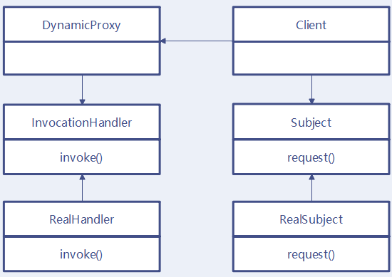

# 代理

代理分为静态代理和动态代理，区别如下：

-   静态代理：代理类是编码时写好的。
-   动态代理：代理类是运行时动态生成的。

## 代理模式

定义：给某个对象提供一个代理对象，并由代理对象控制对于原对象的访问，即客户不直接操控原对象，而是通过代理对象间接地操控原对象。

委托类和代理类都继承于统一接口，委托来实现功能，代理类提供功能，委托类聚合在代理类里面。

优点：

-   可以隐藏委托类的实现;

-   可以实现客户与委托类间的解耦，在不修改委托类代码的情况下能够做一些额外的处理。


## 静态代理

若代理类在程序运行前就已经存在，那么这种代理方式被称为静态代理 。

通常情况下， 静态代理中的代理类和委托类会实现同一接口或是派生自相同的父类。

静态代理的局限在于运行前必须编写好代理类。

>   静态代理其实就是指设计模式中的代理模式。

**Subject** 定义了 RealSubject 和 Proxy 的公共接口，这样就在任何使用 RealSubject 的地方都可以使用 Proxy 。

```java
abstract class Subject {
    public abstract void Request();
}
```

**RealSubject** 定义 Proxy 所代表的真实业务。

```java
class RealSubject extends Subject {
    @Override
    public void Request() {
        System.out.println("真实的请求");
    }
}
```

**Proxy** 保存一个引用使得代理可以访问实体，并提供一个与 Subject 的接口相同的接口，这样代理就可以用来替代实体。

```java
class Proxy extends Subject {
    private RealSubject real;

    @Override
    public void Request() {
        if (null == real) {
            real = new RealSubject();
        }
        real.Request();
    }
}
```

静态代理模式固然在访问无法访问的资源，增强现有的接口业务功能方面有很大的优点，但是大量使用这种静态代理，会使我们系统内的类的规模增大，并且不易维护；并且由于 Proxy 和 RealSubject 的功能本质上是相同的，Proxy 只是起到了中介的作用，这种代理在系统中的存在，导致系统结构比较臃肿和松散。

## 动态代理

动态代理的产生是为了解决静态代理的问题。

>   代理类在程序运行时创建的代理方式被称为动态代理。
>
>   相比于静态代理， 动态代理的优势在于可以很方便的对代理类的函数进行统一的处理，而不用修改每个代理类的函数。

动态代理是一种方便运行时动态构建代理、动态处理代理方法调用的机制，很多场景都是利用类似机制做到的，比如用来包装 RPC 调用、面向切面的编程（AOP）。

JDK 动态代理特点：

- 优点：相对于静态代理模式，不需要硬编码接口，代码复用率高。

- 缺点：强制要求代理类实现 `InvocationHandler` 接口。

在运行状态中，需要代理的地方，根据 Subject 和 RealSubject，动态地创建一个 Proxy，用完之后，就会销毁，这样就可以避免了 Proxy 角色的 class 在系统中冗杂的问题了。

实现动态代理的方式很多，比如 JDK 自身提供的动态代理，就是主要利用了反射机制。还有其他的实现方式，比如利用传说中更高性能的字节码操作机制，类似 ASM、cglib（基于 ASM）、Javassist 等。

Java动态代理主要的实现有两种方法：JDK动态代理、CGLIB动态代理。

这两种动态代理生成动态代理类的方法，都是生成字节码，然后覆盖字节码，区别是JDK动态代理是继承Proxy实现接口，采用反射的方式调用函数；CGLIB动态代理是通过继承委托类，覆盖被代理方法。以及由此产生的其他差异：

-   JDK动态代理：Proxy类提供，原理是反射，只能代理接口，不可以按函数选择不同的处理器。
-   CGLIB动态代理：原理是继承后重写方法中拦截方法调用，效率比反射高，可以代理类，可以按函数选择不同的处理器，不能代理final。

### 动态代理详情



Java 动态代理基于经典代理模式，引入了一个 `InvocationHandler`，`InvocationHandler` 负责统一管理所有的方法调用。

动态代理步骤：

1. 获取 RealSubject 上的所有接口列表；
2. 确定要生成的代理类的类名，默认为：`org.example.proxy.$ProxyXXXX`；
3. 根据需要实现的接口信息，在代码中动态创建该 Proxy 类的字节码；
4. 将对应的字节码转换为对应的 class 对象；
5. 创建 `InvocationHandler` 实例 handler，用来处理 `Proxy` 所有方法调用；
6. Proxy 的 class 对象 以创建的 handler 对象为参数，实例化一个 proxy 对象。

从上面可以看出，JDK 动态代理的实现是基于实现接口的方式，使得 Proxy 和 RealSubject 具有相同的功能。

但其实还有一种思路：通过继承。即：让 Proxy 继承 RealSubject，这样二者同样具有相同的功能，Proxy 还可以通过重写 RealSubject 中的方法，来实现多态。CGLIB 就是基于这种思路设计的。

在 Java 的动态代理机制中，有两个重要的类（接口），一个是 `InvocationHandler` 接口、另一个则是 `Proxy` 类，这一个类和一个接口是实现我们动态代理所必须用到的。

## JDK动态代理

在JDK动态代理中，代理类与委托类实现同一接口，主要是通过代理类实现 `InvocationHandler` 并重写 `invoke` 方法来进行动态代理的，在 `invoke` 方法中将对方法进行处理。

### 委托类

委托类是真正实现了接口方法对应业务代码的类。

举例实现如下：

```
public class Vendor implements Sell { 
    public void sell() { 
        System.out.println("In sell method"); 
    }

    public void ad() {
        System,out.println("ad method");
    }
} 
```

### InvocationHandler接口

在使用动态代理时，我们需要定义一个位于代理类与委托类之间的中介类，这个中介类被要求实现InvocationHandler接口。

`InvocationHandler` 接口定义：

```java
public interface InvocationHandler {
    public Object invoke(Object proxy, Method method, Object[] args)
        throws Throwable;
}
```

每一个动态代理类都必须要实现 `InvocationHandler` 这个接口，并且每个代理类的实例都关联到了一个 Handler，当我们通过代理对象调用一个方法的时候，这个方法的调用就会被转发为由 `InvocationHandler` 这个接口的 `invoke` 方法来进行调用。

我们来看看 InvocationHandler 这个接口的唯一一个方法 invoke 方法：

```java
Object invoke(Object proxy, Method method, Object[] args) throws Throwable
```

参数说明：

- **proxy**：代理的真实对象。
- **method**：所要调用真实对象的某个方法的 `Method` 对象
- **args**：所要调用真实对象某个方法时接受的参数

实现了InvocationHandler接口的中介类用做“调用处理器”。

当我们调用代理类对象的方法时，这个“调用”会转送到invoke方法中，代理类对象作为proxy参数传入，参数method标识了我们具体调用的是代理类的哪个方法，args为这个方法的参数。

这样一来，我们对代理类中的所有方法的调用都会变为对invoke的调用，这样我们可以在invoke方法中添加统一的处理逻辑(也可以根据method参数对不同的代理类方法做不同的处理)。因此我们只需在中介类的invoke方法实现中输出“before”，然后调用委托类的invoke方法，再输出“after”。

### 中介类

中介类必须实现InvocationHandler接口，作为调用处理器”拦截“对代理类方法的调用。中介类的定义如下：

```
public class DynamicProxy implements InvocationHandler { 
    //obj为委托类对象; 
    private Object obj; 

    public DynamicProxy(Object obj) {
        this.obj = obj;
    } 

    @Override 
    public Object invoke(Object proxy, Method method, Object[] args) throws Throwable { 
        System.out.println("before"); 
        Object result = method.invoke(obj, args); 
        System.out.println("after"); 
        return result; 
    }
} 
```

如代码所示，中间类通过聚合方式持有委托类对象引用，把外部对invoke的调用最终都转为对委托类对象的调用，这其实就是一个静态代理的实现。

### Proxy类

`Proxy` 这个类的作用就是用来动态创建一个代理对象的类，它提供了许多的方法，但是我们用的最多的就是 `newProxyInstance` 这个方法：

```java
//该方法用于为指定类装载器、一组接口及调用处理器生成动态代理类实例
public static Object newProxyInstance(ClassLoader loader, Class<?>[] interfaces,  InvocationHandler h)  throws IllegalArgumentException
```

这个方法的作用就是得到一个动态的代理对象。

参数说明：

- **loader**：一个 `ClassLoader` 对象，定义了由哪个 `ClassLoader` 对象来对生成的代理对象进行加载。
- **interfaces**：一个 `Class<?>` 对象的数组，表示的是我将要给我需要代理的对象提供一组什么接口，如果我提供了一组接口给它，那么这个代理对象就宣称实现了该接口(多态)，这样我就能调用这组接口中的方法了
- **h**：一个 `InvocationHandler` 对象，表示的是当我这个动态代理对象在调用方法的时候，会关联到的`InvocationHandler` 对象上

### JDK动态代理机制

**使用JDK动态代理四步骤：**

1. 通过实现 InvocationHandler 接口创建自己的调用处理器；
2. 通过为 Proxy 类指定 ClassLoader 对象和一组 interface 来创建动态代理类；
3. 通过反射机制获得动态代理类的构造函数，其唯一参数类型是调用处理器接口类型；
4. 通过构造函数创建动态代理类实例，构造时调用处理器对象作为参数被传入。

**JDK动态代理对象创建过程**

```
// InvocationHandlerImpl 实现了 InvocationHandler 接口，并能实现方法调用从代理类到委托类的分派转发
// 其内部通常包含指向委托类实例的引用，用于真正执行分派转发过来的方法调用
InvocationHandler handler = new InvocationHandlerImpl(..); 

// 通过 Proxy 为包括 Interface 接口在内的一组接口动态创建代理类的类对象
Class clazz = Proxy.getProxyClass(classLoader, new Class[] { Interface.class, ... }); 

// 通过反射从生成的类对象获得构造函数对象
Constructor constructor = clazz.getConstructor(new Class[] { InvocationHandler.class }); 

// 通过构造函数对象创建动态代理类实例
Interface Proxy = (Interface)constructor.newInstance(new Object[] { handler });
```

实际使用中，2-4步被Proxy封装了，代码为：

```
// InvocationHandlerImpl 实现了 InvocationHandler 接口，并能实现方法调用从代理类到委托类的分派转发
InvocationHandler handler = new InvocationHandlerImpl(..); 

// 通过 Proxy 直接创建动态代理类实例
Interface proxy = (Interface)Proxy.newProxyInstance( classLoader, 
     new Class[] { Interface.class }, 
     handler );
```

**JDK动态代理生成类**

类名：格式是“$ProxyN”，其中 N 是一个逐一递增的阿拉伯数字，代表 Proxy 类第 N 次生成的动态代理类，

值得注意的一点是，并不是每次调用 Proxy 的静态方法创建动态代理类都会使得 N 值增加，原因是如果对同一组接口（包括接口排列的顺序相同）试图重复创建动态代理类，它会很聪明地返回先前已经创建好的代理类的类对象，而不会再尝试去创建一个全新的代理类，这样可以节省不必要的代码重复生成，提高了代理类的创建效率。

**JDK动态代理类继承关系**

关系图： 

由图可见，Proxy 类是它的父类，这个规则适用于所有由 Proxy 创建的动态代理类。 而且该类还实现了其所代理的一组接口，这就是为什么它能够被安全地类型转换到其所代理的某接口的根本原因。

每个代理类实例都会关联一个调用处理器对象，可以通过 Proxy 提供的静态方法 getInvocationHandler 去获得代理类实例的调用处理器对象。在代理类实例上调用其代理的接口中所声明的方法时，这些方法最终都会由调用处理器的 invoke 方法执行。

**JDK动态代理的缺点**

由继承关系可以看出，动态代理类的父类是Proxy，这就导致它始终无法摆脱仅支持 interface 代理的桎梏，因为它的设计注定了这个遗憾。

Java 的继承机制注定了这些动态代理类们无法实现对 class 的动态代理，原因是多继承在 Java 中本质上就行不通。

### JDK动态生成代理类

相关代码如下：

```
public class Main { 
    public static void main(String[] args) {
        //创建中介类实例 
        DynamicProxy inter = new DynamicProxy(new Vendor()); 
        //加上这句将会产生一个$Proxy0.class文件，这个文件即为动态生成的代理类文件
        System.getProperties().put("sun.misc.ProxyGenerator.saveGeneratedFiles","true"); 

        //获取代理类实例sell 
        Sell sell = (Sell)(Proxy.newProxyInstance(Sell.class.getClassLoader(), new Class[] {Sell.class}, inter)); 

        //通过代理类对象调用代理类方法，实际上会转到invoke方法调用 
        sell.sell(); 
        sell.ad(); 
    }
} 
```

上面我们已经简单提到过动态代理的原理，这里再简单的总结下：首先通过newProxyInstance方法获取代理类实例，而后我们便可以通过这个代理类实例调用代理类的方法，对代理类的方法的调用实际上都会调用中介类(调用处理器)的invoke方法，在invoke方法中我们调用委托类的相应方法，并且可以添加自己的处理逻辑。

### 动态生成的代理类

```
public final class $Proxy1 extends Proxy implements Subject{
    private InvocationHandler h;
    private $Proxy1(){}
    public $Proxy1(InvocationHandler h){
        this.h = h;
    }
    public int request(int i){
        Method method = Subject.class.getMethod("request", new Class[]{int.class}); //创建method对象
        return (Integer)h.invoke(this, method, new Object[]{new Integer(i)}); //调用了invoke方法
    }
}
```

### Proxy源码

**关键变量**

```
// 映射表：用于维护类装载器对象到其对应的代理类缓存，这是个缓存，防止多次加载同一个类。
private static Map loaderToCache = new WeakHashMap(); 

// 标记：用于标记一个动态代理类正在被创建中
private static Object pendingGenerationMarker = new Object(); 

// 同步表：记录已经被创建的动态代理类类型，主要被方法 isProxyClass 进行相关的判断
private static Map proxyClasses = Collections.synchronizedMap(new WeakHashMap()); 

// 关联的调用处理器引用
protected InvocationHandler h;
```

**构造方法**

```
// 由于 Proxy 内部从不直接调用构造函数，所以 private 类型意味着禁止任何调用
private Proxy() {} 

// 由于 Proxy 内部从不直接调用构造函数，所以 protected 意味着只有子类可以调用
protected Proxy(InvocationHandler h) {this.h = h;}
```

生成动态代理类的静态方法 newProxyInstance 

```
public static Object newProxyInstance(ClassLoader loader, 
            Class<?>[] interfaces, 
            InvocationHandler h) 
            throws IllegalArgumentException { 

    // 检查 h 不为空，否则抛异常
    if (h == null) { 
        throw new NullPointerException(); 
    } 

    // 获得与制定类装载器和一组接口相关的代理类类型对象
    Class cl = getProxyClass(loader, interfaces); 

    // 通过反射获取构造函数对象并生成代理类实例
    try { 
        Constructor cons = cl.getConstructor(constructorParams); 
        return (Object) cons.newInstance(new Object[] { h }); 
    } catch (NoSuchMethodException e) { throw new InternalError(e.toString()); 
    } catch (IllegalAccessException e) { throw new InternalError(e.toString()); 
    } catch (InstantiationException e) { throw new InternalError(e.toString()); 
    } catch (InvocationTargetException e) { throw new InternalError(e.toString()); 
    } 
}
```

**关键函数 getProxyClass**

getProxyClass方法负责为一组接口动态地生成代理类类型对象。

方法分4个步骤：

1.对这组接口进行一定程度的安全检查，包括检查接口类对象是否对类装载器可见并且与类装载器所能识别的接口类对象是完全相同的，还会检查确保是 interface 类型而不是 class 类型。这个步骤通过一个循环来完成，检查通过后将会得到一个包含所有接口名称的字符串数组，记为 String[] interfaceNames。总体上这部分实现比较直观，所以略去大部分代码，仅保留留如何判断某类或接口是否对特定类装载器可见的相关代码。

```
//通过 Class.forName 方法判接口的可见性
try { 
    // 指定接口名字、类装载器对象，同时制定 initializeBoolean 为 false 表示无须初始化类
    // 如果方法返回正常这表示可见，否则会抛出 ClassNotFoundException 异常表示不可见
    interfaceClass = Class.forName(interfaceName, false, loader); 
} catch (ClassNotFoundException e) { 
}
```

2.从 loaderToCache 映射表中获取以类装载器对象为关键字所对应的缓存表，如果不存在就创建一个新的缓存表并更新到 loaderToCache。缓存表是一个 HashMap 实例，正常情况下它将存放键值对（接口名字列表，动态生成的代理类的类对象引用）。当代理类正在被创建时它会临时保存（接口名字列表，pendingGenerationMarker）。标记 pendingGenerationMarke 的作用是通知后续的同类请求（接口数组相同且组内接口排列顺序也相同）代理类正在被创建，请保持等待直至创建完成。

```
//缓存表的使用
do { 
    // 以接口名字列表作为关键字获得对应 cache 值
    Object value = cache.get(key); 
    if (value instanceof Reference) { 
        proxyClass = (Class) ((Reference) value).get(); 
    } 
    if (proxyClass != null) { 
        // 如果已经创建，直接返回
        return proxyClass; 
    } else if (value == pendingGenerationMarker) { 
        // 代理类正在被创建，保持等待
        try { 
            cache.wait(); 
        } catch (InterruptedException e) { 
        } 
        // 等待被唤醒，继续循环并通过二次检查以确保创建完成，否则重新等待
        continue; 
    } else { 
        // 标记代理类正在被创建
        cache.put(key, pendingGenerationMarker); 
        // break 跳出循环已进入创建过程
        break; 
} while (true);
```

3.动态创建代理类的类对象。首先是确定代理类所在的包，其原则如前所述，如果都为 public 接口，则包名为空字符串表示顶层包；如果所有非 public 接口都在同一个包，则包名与这些接口的包名相同；如果有多个非 public 接口且不同包，则抛异常终止代理类的生成。确定了包后，就开始生成代理类的类名，同样如前所述按格式“$ProxyN”生成。类名也确定了，接下来就是见证奇迹的发生 —— 动态生成代理类：

```
// 动态生成代理类
// 动态地生成代理类的字节码数组
byte[] proxyClassFile = ProxyGenerator.generateProxyClass( proxyName, interfaces); 
try { 
    // 动态地定义新生成的代理类
    proxyClass = defineClass0(loader, proxyName, proxyClassFile, 0,  proxyClassFile.length); 
} catch (ClassFormatError e) { 
    throw new IllegalArgumentException(e.toString()); 
} 

// 把生成的代理类的类对象记录进 proxyClasses 表
proxyClasses.put(proxyClass, null);
```

由此可见，所有的代码生成的工作都由神秘的 ProxyGenerator 所完成了，当你尝试去探索这个类时，你所能获得的信息仅仅是它位于并未公开的 sun.misc 包，有若干常量、变量和方法以完成这个神奇的代码生成的过程，但是 sun 并没有提供源代码以供研读。至于动态类的定义，则由 Proxy 的 native 静态方法 defineClass0 执行。

ProxyGenerator虽然没提供，但其生成的代理类的实现，我们应该是容易猜测的：生成接口的所有方法，方法处理逻辑为通过反射调用中间类的invoke方法。而做法就是替换修改字节码里面的各接口实现了，其实修改后的内容都是类似的，都是反射调用，所以如果写个函数名为入参的公共反射调用函数，就更容易了。

4.代码生成过程进入结尾部分，根据结果更新缓存表，如果成功则将代理类的类对象引用更新进缓存表，否则清楚缓存表中对应关键值，最后唤醒所有可能的正在等待的线程。

### JDK 动态代理实例

上面的内容介绍完这两个接口(类)以后，我们来通过一个实例来看看我们的动态代理模式是什么样的：

首先我们定义了一个 Subject 类型的接口，为其声明了两个方法：

```java
public interface Subject {

    void hello(String str);

    String bye();
}
```

接着，定义了一个类来实现这个接口，这个类就是我们的真实对象，RealSubject 类：

```java
public class RealSubject implements Subject {

    @Override
    public void hello(String str) {
        System.out.println("Hello  " + str);
    }

    @Override
    public String bye() {
        System.out.println("Goodbye");
        return "Over";
    }
}
```

下一步，我们就要定义一个动态代理类了，前面说个，每一个动态代理类都必须要实现 InvocationHandler 这个接口，因此我们这个动态代理类也不例外：

```java
public class InvocationHandlerDemo implements InvocationHandler {
    // 这个就是我们要代理的真实对象
    private Object subject;

    // 构造方法，给我们要代理的真实对象赋初值
    public InvocationHandlerDemo(Object subject) {
        this.subject = subject;
    }

    @Override
    public Object invoke(Object object, Method method, Object[] args)
        throws Throwable {
        // 在代理真实对象前我们可以添加一些自己的操作
        System.out.println("Before method");

        System.out.println("Call Method: " + method);

        // 当代理对象调用真实对象的方法时，其会自动的跳转到代理对象关联的handler对象的invoke方法来进行调用
        Object obj = method.invoke(subject, args);

        // 在代理真实对象后我们也可以添加一些自己的操作
        System.out.println("After method");
        System.out.println();

        return obj;
    }
}
```

最后，来看看我们的 Client 类：

```java
public class Client {
    public static void main(String[] args) {
        // 我们要代理的真实对象
        Subject realSubject = new RealSubject();

        // 我们要代理哪个真实对象，就将该对象传进去，最后是通过该真实对象来调用其方法的
        InvocationHandler handler = new InvocationHandlerDemo(realSubject);

        /*
         * 通过Proxy的newProxyInstance方法来创建我们的代理对象，我们来看看其三个参数
         * 第一个参数 handler.getClass().getClassLoader() ，我们这里使用handler这个类的ClassLoader对象来加载我们的代理对象
         * 第二个参数realSubject.getClass().getInterfaces()，我们这里为代理对象提供的接口是真实对象所实行的接口，表示我要代理的是该真实对象，这样我就能调用这组接口中的方法了
         * 第三个参数handler， 我们这里将这个代理对象关联到了上方的 InvocationHandler 这个对象上
         */
        Subject subject = (Subject)Proxy.newProxyInstance(handler.getClass().getClassLoader(), realSubject
                .getClass().getInterfaces(), handler);

        System.out.println(subject.getClass().getName());
        subject.hello("World");
        String result = subject.bye();
        System.out.println("Result is: " + result);
    }
}
```

我们先来看看控制台的输出：

```
org.exampleproxy.$Proxy0
Before method
Call Method: public abstract void io.github.dunwu.javacore.reflect.InvocationHandlerDemo$Subject.hello(java.lang.String)
Hello  World
After method

Before method
Call Method: public abstract java.lang.String io.github.dunwu.javacore.reflect.InvocationHandlerDemo$Subject.bye()
Goodbye
After method

Result is: Over
```

我们首先来看看 `org.exampleproxy.$Proxy0` 这东西，我们看到，这个东西是由 `System.out.println(subject.getClass().getName());` 这条语句打印出来的，那么为什么我们返回的这个代理对象的类名是这样的呢？

```java
Subject subject = (Subject)Proxy.newProxyInstance(handler.getClass().getClassLoader(), realSubject
                .getClass().getInterfaces(), handler);
```

可能我以为返回的这个代理对象会是 Subject 类型的对象，或者是 InvocationHandler 的对象，结果却不是，首先我们解释一下**为什么我们这里可以将其转化为 Subject 类型的对象？**

原因就是：在 newProxyInstance 这个方法的第二个参数上，我们给这个代理对象提供了一组什么接口，那么我这个代理对象就会实现了这组接口，这个时候我们当然可以将这个代理对象强制类型转化为这组接口中的任意一个，因为这里的接口是 Subject 类型，所以就可以将其转化为 Subject 类型了。

**同时我们一定要记住，通过 `Proxy.newProxyInstance` 创建的代理对象是在 jvm 运行时动态生成的一个对象，它并不是我们的 InvocationHandler 类型，也不是我们定义的那组接口的类型，而是在运行是动态生成的一个对象，并且命名方式都是这样的形式，以\$开头，proxy 为中，最后一个数字表示对象的标号**。

接着我们来看看这两句

```
subject.hello("World");
String result = subject.bye();
```

这里是通过代理对象来调用实现的那种接口中的方法，这个时候程序就会跳转到由这个代理对象关联到的 handler 中的 invoke 方法去执行，而我们的这个 handler 对象又接受了一个 RealSubject 类型的参数，表示我要代理的就是这个真实对象，所以此时就会调用 handler 中的 invoke 方法去执行。

我们看到，在真正通过代理对象来调用真实对象的方法的时候，我们可以在该方法前后添加自己的一些操作，同时我们看到我们的这个 method 对象是这样的：

```java
public abstract void io.github.dunwu.javacore.reflect.InvocationHandlerDemo$Subject.hello(java.lang.String)
public abstract java.lang.String io.github.dunwu.javacore.reflect.InvocationHandlerDemo$Subject.bye()
```

正好就是我们的 Subject 接口中的两个方法，这也就证明了当我通过代理对象来调用方法的时候，起实际就是委托由其关联到的 handler 对象的 invoke 方法中来调用，并不是自己来真实调用，而是通过代理的方式来调用的。

## CGlib动态代理

JDK动态代理的缺点是：由于动态代理类已经继承了Proxy类，所以不能再集成委托类，所以就不能代理类，只能代理接口。而CGlib动态代理，则是为了弥补这个缺点，提供了对类的动态代理能力。

### 什么是CGLIB

CGLIB是一个功能强大，高性能的代码生成包。它为没有实现接口的类提供代理，为JDK的动态代理提供了很好的补充。

通常可以使用Java的动态代理创建代理，但当要代理的类没有实现接口或者为了更好的性能，CGLIB是一个好的选择。

CGLIB 提供了与 JDK 动态代理不同的方案。很多框架，例如 Spring AOP 中，就使用了 CGLIB 动态代理。

CGLIB 底层，其实是借助了 ASM 这个强大的 Java 字节码框架去进行字节码增强操作。

CGLIB 动态代理的工作步骤：

- 生成代理类的二进制字节码文件；
- 加载二进制字节码，生成 `Class` 对象( 例如使用 `Class.forName()` 方法 )；
- 通过反射机制获得实例构造，并创建代理类对象。

CGLIB 动态代理特点：

优点：使用字节码增强，比 JDK 动态代理方式性能高。可以在运行时对类或者是接口进行增强操作，且委托类无需实现接口。

缺点：不能对 `final` 类以及 `final` 方法进行代理。

### CGLIB原理

CGLIB原理：动态生成一个要代理类的子类，子类重写要代理的类的所有不是final的方法。

在子类中采用方法拦截的技术拦截所有父类方法的调用，顺势织入横切逻辑。它比使用java反射的JDK动态代理要快。

CGLIB底层：使用字节码处理框架ASM，来转换字节码并生成新的类。

不鼓励直接使用ASM，因为它要求你必须对JVM内部结构包括class文件的格式和指令集都很熟悉。

**CGLIB缺点：对于final方法，无法进行代理。因为CGLib原理是动态生成被代理类的子类。**

### CGLIB的应用

广泛的被许多AOP的框架使用，例如Spring AOP和dynaop。Hibernate使用CGLIB来代理单端single-ended(多对一和一对一)关联。

### CGLIB的API

**1、jar**

cglib-nodep-2.2.jar：使用nodep包不需要关联asm的jar包,jar包内部包含asm的类.

cglib-2.2.jar：使用此jar包需要关联asm的jar包,否则运行时报错.

**2、类库**

net.sf.cglib.core:底层字节码处理类，他们大部分与ASM有关系。

net.sf.cglib.transform:编译期或运行期类和类文件的转换

**net.sf.cglib.proxy:实现创建代理和方法拦截器的类**

net.sf.cglib.reflect:实现快速反射和C#风格代理的类

net.sf.cglib.util:集合排序等工具类

net.sf.cglib.beans:JavaBean相关的工具类

### CGLIB使用动态代理步骤

**1、被代理类：**

```
public class TargetObject {
    public String method1(String paramName) {
        return paramName;
    }

    public int method2(int count) {
        return count;
    }

    public int method3(int count) {
        return count;
    }

    @Override
    public String toString() {
        return "TargetObject []"+ getClass();
    }
}
```

**2、拦截器：**

定义一个拦截器。在调用目标方法时，CGLib会回调MethodInterceptor接口方法拦截，来实现你自己的代理逻辑，类似于JDK中的InvocationHandler接口。

```
public class TargetInterceptor implements MethodInterceptor{     
    /**
     * 重写方法拦截在方法前和方法后加入业务
     * Object obj为目标对象
     * Method method为目标方法
     * Object[] params 为参数，
     * MethodProxy proxy CGlib方法代理对象
     */
    @Override
    public Object intercept(Object obj, Method method, Object[] params,
            MethodProxy proxy) throws Throwable {
        System.out.println("调用前");
        Object result = proxy.invokeSuper(obj, params);
        System.out.println(" 调用后"+result);
        return result;
    }    
}
```

参数：

```
Object为由CGLib动态生成的代理类实例，  
Method为上文中实体类所调用的被代理的方法引用，  
Object[]为参数值列表，  
MethodProxy为生成的代理类对方法的代理引用。
```

返回：从代理实例的方法调用返回的值。

其中，proxy.invokeSuper(obj,arg)：调用代理类实例上的proxy方法的父类方法（即实体类TargetObject中对应的方法）

在这个示例中，只在调用被代理类方法前后各打印了一句话，当然实际编程中可以是其它复杂逻辑。

**3、生成动态代理类：**

```
public class TestCglib {
    public static void main(String[] args) {
        Enhancer enhancer =new Enhancer();
        enhancer.setSuperclass(TargetObject.class);
        enhancer.setCallback(new TargetInterceptor());
        TargetObject targetObject2=(TargetObject)enhancer.create();
        System.out.println(targetObject2);
        System.out.println(targetObject2.method1("mmm1"));
        System.out.println(targetObject2.method2(100));
        System.out.println(targetObject2.method3(200));
    }
}
```

这里Enhancer类是CGLib中的一个字节码增强器，它可以方便的对你想要处理的类进行扩展，以后会经常看到它。

首先将被代理类TargetObject设置成父类，然后设置拦截器TargetInterceptor，最后执行enhancer.create()动态生成一个代理类，并从Object强制转型成父类型TargetObject。

最后，在代理类上调用方法.

**4、回调过滤器CallbackFilter**

一、作用

在CGLib回调时可以设置对不同方法执行不同的回调逻辑，或者根本不执行回调。

在JDK动态代理中并没有类似的功能，对InvocationHandler接口方法的调用对代理类内的所以方法都有效。

定义实现过滤器CallbackFilter接口的类：

```
public class TargetMethodCallbackFilter implements CallbackFilter {

    /**
     * 过滤方法
     * 返回的值为数字，代表了Callback数组中的索引位置，要到用的Callback
     */
    @Override
    public int accept(Method method) {
        if(method.getName().equals("method1")){
            System.out.println("filter method1 ==0");
            return 0;
        }
        if(method.getName().equals("method2")){
            System.out.println("filter method2 ==1");
            return 1;
        }
        if(method.getName().equals("method3")){
            System.out.println("filter method3 ==2");
            return 2;
        }
        return 0;
    }

}
```

其中return值为被代理类的各个方法在回调数组Callback[]中的位置索引（见下文）。 而Callback的子类有：
InvocationHandler、MethodInterceptor、FixedValue(锁定返回值)、Dispatcher、LazyLoader等10个左右。

调用的地方：

```
Callback noopCb=NoOp.INSTANCE;
Callback callback1=new TargetInterceptor();
Callback fixedValue=new TargetResultFixed();
Callback[] cbarray=new Callback[]{callback1,noopCb,fixedValue};

enhancer.setCallbacks(cbarray);
enhancer.setCallbackFilter(callbackFilter);
```

**5.延迟加载对象**

上文讲到Callback的子类中有LazyLoader和Dispatcher。这两者都可以实现延迟加载。

Dispatcher和LazyLoader的区别在于：

-   LazyLoader只在第一次访问延迟加载属性时触发代理类回调方法
-   Dispatcher在每次访问延迟加载属性时都会触发代理类回调方法

## 参考

-   [Java动态代理](https://juejin.cn/post/6844903591501627405)
-   [CGLIB介绍与原理](https://blog.csdn.net/zghwaicsdn/article/details/50957474)
