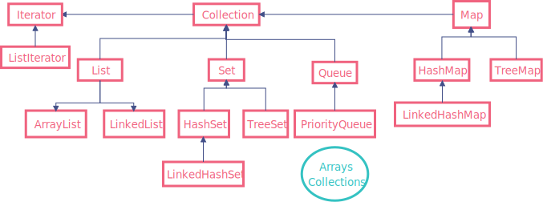

# 简介

Java集合类是一种特别有用的工具类，可以用于存储数量不等的对象，并可以实现常用的数据结构，如栈、队列等。Java集合就像一种容器，可以把多个对象(实际上是对象的引用，但习惯上都称对象) “丢进” 该容器中。

Java 容器框架主要分为 `Collection` 和 `Map` 两种。其中，`Collection` 又分为 `List`、`Set` 以及 `Queue`。

以Collection接口为根接口的一众实现保存的是单值数据，而以Map为根接口的一众实现保存的是键值（Key-value）对数据。

- `Collection` ：一个独立元素的序列，这些元素都服从一条或者多条规则。
    - `List`：一个有序的集合，可以包含重复的元素，提供了按索引访问的方式。必须按照插入的顺序保存元素。
    - `Set` ：不能包含重复的元素。SortedSet是一个按照升序排列元素的Set。
    - `Queue`：定义了队列操作。按照排队规则来确定对象产生的顺序（通常与它们被插入的顺序相同）。
- `Map` ：包含了key-value对。Map不能包含重复的key。SortedMap是一个按照升序排列key的Map。
